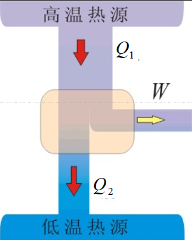
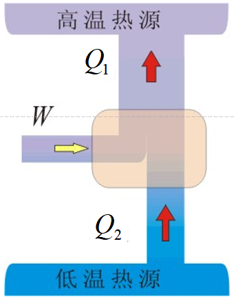

# 热力学基础

# 9.1 热力学的基本概念

## 一、热学概述

1. **热现象**

    与温度相关的各类宏观现象：物态变化、热胀冷缩、气体压强变化、摩擦生热等。

1. **研究对象**

    由大量微观粒子（分子、原子）组成的**宏观热力学系统**，研究热现象规律与微观本质。

## 二、热力学系统与外界

1. **基本定义**

    - 热力学系统：被选取的研究对象（气体、液体、固体）。

    - 外界：系统以外，与系统发生相互作用的环境。

2. **系统分类（按物质、能量交换划分）**

|    系统类型|    物质交换|    能量交换|
|---|---|---|
|    孤立系统|    无|    无|
|    封闭系统|    无|    有|
|    开放系统|    有|    有|
## 三、热力学第零定律

1. **内容**

    若系统A、B分别与系统C达到**热平衡**，则A、B二者也一定处于热平衡。

1. **物理意义**

    定义**温度**这一核心状态参量：**处于热平衡的所有系统，温度必然相同**。

## 四、状态参量与温标

描述系统**平衡态**宏观性质的物理量，气体核心参量：压强 $p$ 、体积 $V$ 、温度 $T$ 。

1. **压强** $p$ 

    单位面积器壁受到的气体压力；单位： $\mathrm{Pa}$ （帕斯卡）；

    换算： $1\ \mathrm{atm}=1.01325\times10^5\ \mathrm{Pa}$ （标准大气压）。

2. **体积** $V$ 

    气体分子热运动能到达的空间，即容器容积；单位： $\mathrm{m^3}$ 。

3. **温度** $T$ 

    - 热力学温标（国际标准）：符号 $T$ ，单位 $\mathrm{K}$ （开尔文）；

    - 摄氏温标：符号 $t$ ，单位 $^\circ\mathrm{C}$ ；

    - 换算公式： ${T = t + 273.15}$ 。

## 五、平衡态

1. **定义**

    孤立系统经过足够长时间后，**所有宏观状态参量不再随时间变化**的状态。

1. **特点**

    属于**动态平衡**：宏观性质不变，但微观粒子仍在不停热运动；

注意：若系统与外界有能量交换，即使宏观不变，也不一定是平衡态。

## 六、热力学过程 & 准静态过程

1. **热力学过程**：系统状态随时间发生变化的全过程。

2. **准静态过程**

    过程进行**无限缓慢**，每一个中间状态都近似为平衡态，是**理想过程**。

1. **图像表示**

    在 ${p-V}$ 图中：**一个点代表一个平衡态，一条连续曲线代表一个准静态过程**。

## 七、理想气体状态方程

### 1. 理想气体定义

严格遵守气体三大实验定律的理想化气体，忽略分子体积与分子间相互作用力。

### 2. 三种常用形式（核心公式）

- **物质的量形式（最常用）**

     ${pV = \nu RT}$ 

     $\nu$ ：物质的量（ $\mathrm{mol}$ ）； $R=8.31\ \mathrm{J/(mol\cdot K)}$ （摩尔气体常量）。
- **质量形式**

    ${pV = \dfrac{m}{M}RT}$ 

    $m$ ：气体总质量； $M$ ：气体摩尔质量。
- **分子数形式**

    ${p = nkT}$ 

    $n$ ：分子数密度； $k=1.38\times10^{-23}\ \mathrm{J/K}$ （玻尔兹曼常量）；

     ${n=\dfrac{N}{V}}$ ； $N$ ：分子总个数；

     $R = N_\mathrm{A}k$ ， $N_\mathrm{A}=6.02\times10^{23}\ \mathrm{mol^{-1}}$ （阿伏伽德罗常量）。

### 3. 标准状态

 $p_0=1.01325\times10^5\ \mathrm{Pa}$ ， $T_0=273.15\ \mathrm{K}$ ；
 1mol理想气体体积 $V_0=22.4\times10^{-3}\ \mathrm{m^3}$ 。

# 9.2 热力学第一定律

## 一、内能

1. **定义**

    系统内**分子热运动总动能 + 分子间相互作用势能**的总和。

1. **理想气体内能**

    无分子势能，内能仅由分子热运动动能决定，**是温度的单值函数**： ${E=E(T)}$ 。

2. **性质**

    **状态量**：只由初、末状态决定，与变化过程无关；不包含系统整体的宏观机械能。

## 二、改变内能的两种方式

1. **做功**：宏观力作用实现能量交换（机械能 $\leftrightarrow$ 内能），**过程量**。

2. **热传递**：因温度差传递能量，传递的能量称为**热量** $Q$ ，**过程量**。

补充：功、热量是**过程量**；内能、 $p、V、T$ 是**状态量**。

## 三、热力学第一定律（热学形式的能量守恒）

### 1. 文字表述

系统吸收的热量，一部分用于增加自身内能，另一部分用于系统对外做功。

### 2. 符号规定（统一标准）

-  $Q>0$ ：系统吸热； $Q<0$ ：系统放热

-  $W>0$ ：系统**对外做功**； $W<0$ ：外界**对系统做功**

-  $\Delta E>0$ ：内能增加； $\Delta E<0$ ：内能减少

### 3. 数学表达式

- 有限过程（积分形式）： ${Q = \Delta E + W}$ 

- 无限小元过程（微分形式）： ${dQ = dE + dW}$ 

### 4. 推论：第一类永动机

不需要外界提供能量，却能持续对外做功的机器。

**结论：第一类永动机违背能量守恒，不可能制成。**

## 四、准静态过程的功、热量、内能计算

### 1. 气体体积功

元功： ${dW = p\mathrm{d}V}$ 

有限过程总功： ${W = \displaystyle\int_{V_1}^{V_2} p\mathrm{d}V}$ 

几何意义： $p-V$ 图中过程曲线与体积轴围成的面积。

### 2. 热容系列概念（均为过程量，与过程相关）

1. 热容  $C$ ：系统温度升高1K吸收的热量， $C=\dfrac{dQ}{dT}$ ，单位 $\mathrm{J/K}$ 。

2. 比热容  $c$ ：单位质量物质的热容 $c=\dfrac{C}{m}$
 
3. 摩尔热容  $C_m$ ：1mol物质的热容，热学计算最常用。
   $C_m = \dfrac{C}{\nu}$;$C_m = Mc$
4. - **定容摩尔热容**  $C_{V,m}$ （体积不变）： ${C_{V,m} = \dfrac{i}{2}R}$ 

   - **定压摩尔热容**  $C_{p,m}$（压强不变）${C_{V,m} = (\dfrac{i}{2}+1)R}$ 

5. 迈耶公式: ${C_{p,m} = C_{V,m} + R}$ 
    物理意义：1mol理想气体升温1K，**等压过程比等容过程多吸收8.31J热量**（用于对外做功）。
6. 比热容比（泊松比）

    $\gamma = \dfrac{C_{p,m}}{C_{V,m}}=\dfrac{i+2}{i} > 1$ 
   - 单原子分子（自由度 $i=3$ ）： $C_{V,m}=\dfrac{3}{2}R,\ \gamma=\dfrac{5}{3}$ 

   - 双原子分子（常温 $i=5$ ）： $C_{V,m}=\dfrac{5}{2}R,\ \gamma=\dfrac{7}{5}$ 

### 3. 准静态过程内能增量计算

>${\Delta E = \nu C_{V,m} (T_2-T_1)}=\dfrac mM \dfrac i2 R(T_2-T_1)$ 

$ E =\dfrac mM \dfrac i2 RT$

### 4. 准静态过程热量计算
$Q = C(T_2-T_1)$ 
$Q = mc(T_2-T_1)$
$Q = \nu C_m (T_2-T_1)=\dfrac{m}{M}C_{V,m} (T_2-T_1)$ 
  
# 9.3 热力学第一定律的应用

## 一、四大基本过程

### 1. 等容过程（ $V=const,\ dV=0$ ）

- 过程规律： $\dfrac{p_1}{T_1}=\dfrac{p_2}{T_2}$ （ $p、T$ 成正比）

- 做功： $W=0$ （体积不变，气体不做功）

- 内能增量： $\Delta E = \nu C_{V,m}(T_2-T_1)$ 

- 热量： ${Q_V = \Delta E = \nu C_{V,m}(T_2-T_1)}$ 

- 结论：等容过程中，吸收的热量**全部用来增加内能**。

### 2. 等压过程（ $p=const,\ dp=0$ ）

- 过程规律： $\dfrac{V_1}{T_1}=\dfrac{V_2}{T_2}$ （ $V、T$ 成正比）

- 做功： ${W = p(V_2-V_1) = \nu R(T_2-T_1)}$ 

- 内能增量： $\Delta E = \nu C_{V,m}(T_2-T_1)$ 

- 热量： ${Q_p = \nu C_{p,m}(T_2-T_1)}$ 

- 结论：吸热一部分增加内能，一部分对外做功。

### 3. 等温过程（ $T=const,\ dT=0$ ）

- 过程规律： $pV=\mathrm{常量}$ （玻意耳定律）

- 内能增量： ${\Delta E = 0}$ （理想气体内能仅与温度有关）

- 做功： ${W = \nu RT \ln\dfrac{V_2}{V_1} = \nu RT \ln\dfrac{p_1}{p_2}}$ 

- 热量： ${Q = W}$ 

- 结论：等温膨胀→吸热全部转化为对外做功；等温压缩→外界做功，气体放热。

### 4. 绝热过程（ $Q=0$ ，无热量交换）

- 过程特点： $dQ=0$ ，热力学第一定律简化为  ${dE + dW = 0}$ 

- 内能与做功： ${W = -\Delta E = -\nu C_{V,m}(T_2-T_1)}$ 

    - 绝热膨胀：对外做功，内能减少，**温度降低**；

    - 绝热压缩：外界做功，内能增加，**温度升高**。

#### 绝热方程（泊松公式，三组等价形式）

 $\begin{cases}
pV^\gamma = const \\
TV^{\gamma-1} = const \\
p^{1-\gamma} T^\gamma = const
\end{cases}$ 

####  $p-V$ 图对比：绝热线 vs 等温线

同一状态点下，**绝热线斜率绝对值大于等温线**，绝热过程压强变化更剧烈。

## 二、多方过程（通用过程）

1. 过程方程： $pV^n = const$ ， $n$  为多方指数。

2. 指数对应关系（整合四大过程）：

    -  $n=0$  → 等压过程

    -  $n=1$  → 等温过程

    -  $n=\gamma$  → 绝热过程

    -  $n\to\infty$  → 等容过程
  
多方过程摩尔热容 $C_{n,\text{m}} = \dfrac{\gamma - n}{1 - n} C_{V,\text{m}}$

# 9.4 循环过程与卡诺循环

## 一、循环过程基础

1. **定义**

系统经历一系列状态变化后，**回到初始状态**的全过程。

1. **核心性质**

内能是状态量，循环一周： ${\Delta E_{总}=0}$ 。

1. **分类（按** $p-V$  **图走向）**

    - **正循环（顺时针）**：热机，对外做净功，热→功；

    - **逆循环（逆时针）**：制冷机/热泵，外界对系统做功，低温热量→高温热量。

2. **净功**： $p-V$ 图中**循环闭合曲线包围的面积**。

## 二、热机（正循环）

1. 能量流向：高温热源吸热 $Q_1$  → 对外做净功 $W$  → 向低温热源放热 $Q_2$ 

1. 能量守恒： ${Q_1 = W + Q_2}$ 。

2. **热机效率**（核心指标）

定义：净功与从高温热源吸收热量的比值

 ${\eta = \dfrac{W}{Q_1} = 1 - \dfrac{Q_2}{Q_1}}$ 

特点： $\eta < 1$ ，热机必然向低温热源释放热量。

## 三、制冷机（逆循环）

1. 能量流向：外界做功 $W$  → 从低温冷库吸热 $Q_2$  → 向高温环境放热 $Q_1$ 

2. 能量守恒： ${Q_1 = Q_2 + W}$ 。

3. **制冷系数**（制冷性能指标）

定义：从低温热源吸取的热量与外界输入功的比值

 ${e = \dfrac{Q_2}{W}}=\dfrac{Q_2}{Q_1-Q_2}$ 

特点： $e$ 可大于1，数值越大，制冷效果越好。

## 四、卡诺循环（理想可逆循环）

### 1. 基本定义

由**两个等温过程 + 两个绝热过程**组成，仅与**两个恒温热源**（高温 $T_1$ 、低温 $T_2$ ）交换热量，是理想化可逆循环。

### 2. 卡诺热机（正卡诺循环）

1. 四个分过程：等温膨胀（吸热 $Q_1$ ）→ 绝热膨胀 → 等温压缩（放热 $Q_2$ ）→ 绝热压缩（复位）。

2. **卡诺热机效率**（极限效率）

     ${\eta_\mathrm{卡诺} = 1 - \dfrac{T_2}{T_1}}$ 

3. 重要结论：

    - 效率**仅由两个热源温度决定**，与工作物质无关；

    -  $T_2>0$ ，故 $\eta_\mathrm{卡诺}<1$ ，**热机效率永远无法达到100%**；

    - 提高效率的方法：升高高温热源温度 $T_1$ 、降低低温热源温度 $T_2$ 。

### 3. 卡诺制冷机（逆卡诺循环）

**卡诺制冷系数**：

 ${e_\mathrm{卡诺} = \dfrac{T_2}{T_1 - T_2}}$ 

结论：仅由两热源温度决定， $T_1、T_2$ 温差越小，制冷系数越大。

# 9.5 热力学第二定律 卡诺定理

## 一、可逆过程与不可逆过程

### 1. 可逆过程（理想过程）

系统由状态A→B，再逆向B→A回到初态，**且外界完全恢复原状，无任何遗留影响**。

成立条件：**无摩擦、无能量耗散的准静态过程**。

### 2. 不可逆过程（实际过程）

系统无法复原，或复原后外界不能恢复原状。

**核心规律**：**自然界一切与热现象有关的实际宏观过程，都是不可逆过程**。

### 3. 常见不可逆过程

气体自由膨胀、热传导、热功转换、墨水扩散、物质扩散、破镜难圆、生命过程等。

## 二、热力学第二定律（两种等价表述，揭示过程方向性）

### 1. 开尔文表述（描述**热功转换**的方向性）

不可能制成循环动作的热机，只从**单一热源**吸热，使之完全变为有用功，而**不产生其他影响**。

关键解读：

- 否定**第二类永动机**（单热源热机），第二类永动机不可能制成；

- 实际热机必须配备高、低两个热源，效率必然小于100%。

### 2. 克劳修斯表述（描述**热传导**的方向性）

不可能把热量从**低温物体**传到**高温物体**，而**不引起其他变化**。

关键解读：

- 热量**无法自发**从低温传向高温；

- 若要实现低温→高温传热（制冷机），**外界必须做功**；制冷系数不可能无穷大。

### 3. 两种表述的等效性

逻辑可证：一种表述不成立，则另一种也必然不成立。

**本质**：从两个不同角度，共同揭示**宏观热过程的不可逆性**。

## 三、热力学第二定律的实质

一切与热现象相关的**实际宏观过程都具有固定方向性，均为不可逆过程**；可逆过程仅为理论理想模型。

## 四、卡诺定理（热机效率的理论极限）

前提：所有热机工作在**同一高温热源 $T_1$ 、同一低温热源 $T_2$ **之间。

1. 定理1：**所有可逆热机，效率相等**，等于卡诺效率：

     $\eta_\mathrm{可逆} = 1-\dfrac{T_2}{T_1}$ 

2. 定理2：**所有不可逆热机的效率，小于同温源下可逆热机**：

     $\eta_\mathrm{不可逆} < 1-\dfrac{T_2}{T_1}$ 

## 五、两类永动机对比总结

|永动机类型|核心构想|违背定律|
|---|---|---|
|第一类永动机|不消耗能量，持续对外做功|热力学第一定律（能量守恒）|
|第二类永动机|单热源热机，热量100%转化为功|热力学第二定律（过程方向性）|
