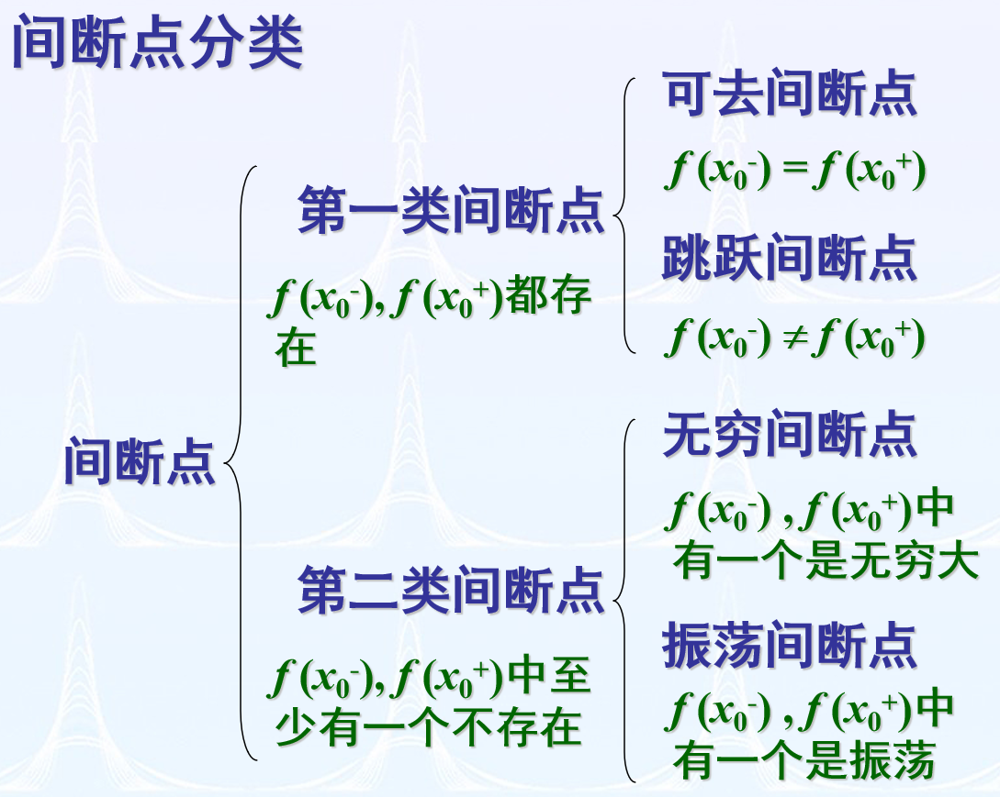

## 函数与极限 
### 数列的极限
#### 一、定义
$$\lim \limits_{n \to \infty} x_n = a \Leftrightarrow \forall \varepsilon>0, \exists正整数N,当n>N时,有|x_n - a| < \varepsilon.$$
>设$\{ x_n \}$为一数列，如果存在常数$a$，对于任意给定的正数 $\varepsilon$ (不论它多么小)，总存在正整数$N$，使得当$n > N$时，不等式 $|x_n - a| < \varepsilon$ 都成立，那么就称常数$a$是数列$\{ x_n \}$的极限，或称数列$\{ x_n \}$收敛于$a$，记为$\lim \limits_{n \to \infty} x_n = a$，或$x_n \to a\ (n \to \infty)$，否则称数列$\{ x_n \}$发散
#### 二、用定义证明数列极限
在用定义证明数列的极限时，关键是对任意给定的$\varepsilon$要求出一个$N(\varepsilon)$，但没必要去求最小的$N(\varepsilon)$。求$N(\varepsilon)$的方法是解不等式
$$|x_n - a| < \varepsilon \implies n > N(\varepsilon)$$

如果不等式$|x_n - a| < \varepsilon$不易解出，可先把$|x_n - a|$放大成$g(n)$，然后再解不等式$g(n) < \varepsilon$得到$N(\varepsilon)$。即
$$|x_n - a| < g(n) < \varepsilon \implies n > N(\varepsilon)$$
### 三、收敛数列的性质
1. **唯一性**
若数列$\{x_n\}$收敛，则它的极限是唯一的。
（不会同时收敛到两个不同的数）
2. **有界性**
若数列$\{x_n\}$收敛，则$\{x_n\}$一定是有界数列。
（存在正数$M$，使得对所有$n$，都有$|x_n| \leq M$）
    - 收敛 $\Rightarrow$ 有界，有界$\nRightarrow$ 收敛
    - 无界 $\Rightarrow$ 发散
3. **保号性**
若$\lim\limits_{n \to \infty} x_n = a$，且$a > 0$（或$a < 0$），则存在正整数$N$，当$n > N$时，有$x_n > 0$（或$x_n < 0$）。
   - 推论：若存在正整数$N$，当$n > N$时$x_n \geq 0$（或$\leq 0$），则$a \geq 0$（或$a \leq 0$）。
1. **子列的收敛性**
若数列$\{x_n\}$收敛于$a$，则它的任意子列$\{x_{n_k}\}$也收敛于$a$。
    - $\{x_n\}$有两个子数列收敛于不同极限 $\Rightarrow$ 发散
    - $\{x_n\}$有一个子数列发散 $\Rightarrow$ 发散
    - $\{x_n\}$所有子列都收敛于$A$ $\Rightarrow$ 收敛
### 函数的极限
#### 一、定义
$\lim\limits_{x \to x_0} f(x) = A \Leftrightarrow\forall \varepsilon>0,\ \exists \delta>0,$ 当$0<|x-x_0|<\delta$时,有$|f(x)-A|<\varepsilon$
>设函数\( f(x) \)在点\( x_0 \)的某一去心邻域内有定义。如果存在常数\( A \)，对于任意给定的正数\( \varepsilon \)（不论它多么小），总存在正数\( \delta \)，使得当\( x \)满足不等式$0 < |x - x_0| < \delta$时，对应的函数值\( f(x) \)都满足不等式$|f(x) - A| < \varepsilon$，那么常数\( A \)就叫做函数\( f(x) \)当\( x \to x_0 \)时的极限，记作$\lim\limits_{x \to x_0} f(x) = A $ 或 $f(x) \to A \ (\text{当} \ x \to x_0).$

左极限：$f(x_0^-) = \lim\limits_{x \to x_0^-} f(x) = A \Leftrightarrow \forall \varepsilon>0,\ \exists \delta>0$, 当\( x_0 - \delta < x < x_0 \)时,有\(|f(x)-A|<\varepsilon\)
右极限：$f(x_0^+) = \lim\limits_{x \to x_0^+} f(x) = A \Leftrightarrow \forall \varepsilon>0,\ \exists \delta>0$, 当\( x_0  < x < x_0 + \delta\)时,有\(|f(x)-A|<\varepsilon\)
- **极限存在$\iff$左右极限存在且相等**
\[ \lim_{x \to x_0} f(x) = A \quad \Longleftrightarrow \quad f(x_0^-) = f(x_0^+) = A \]

$\lim\limits_{x \to \infty} f(x) = A\Leftrightarrow\forall \varepsilon>0,\ \exists X>0, $ 当\( |x|>X \)时，有\( |f(x)-A|<\varepsilon\)
$\lim\limits_{x \to -\infty} f(x) = A \Leftrightarrow
\forall \varepsilon>0,\ \exists X>0,$当\( x<-X \)时，有\( |f(x)-A|<\varepsilon \)
$\lim\limits_{x \to +\infty} f(x) = A\Leftrightarrow\forall \varepsilon>0,\ \exists X>0, $ 当\( x>X \)时，有\( |f(x)-A|<\varepsilon\)
> 极限定义的等价形式（以 \( x \to x_0 \) 为例）
$\lim\limits_{x \to x_0} f(x) = A $
$\Leftrightarrow \lim\limits_{x \to x_0} \left[ f(x) - A \right] = 0$ (即 \( \alpha = f(x) - A \) 为无穷小)
$
\Leftrightarrow f(x_0^-) = f(x_0^+) = A
$
$
\Leftrightarrow \forall \{ x_n \} (x_n \neq x_0), x_n \xrightarrow{n \to \infty} x_0,
$有 \( \lim\limits_{n \to \infty} f(x_n) = A \)
#### 二、函数极限的性质
1.  唯一性
若 $\lim\limits_{x \to x_0} f(x)$ 存在，则此极限值是唯一的。
1.  局部有界性
若 $\lim\limits_{x \to x_0} f(x)$ 存在，则存在 $M>0$ 和 $\delta>0$，使得当 $0<|x-x_0|<\delta$ 时，有 $|f(x)| \leq M$。
1.  局部保号性
若 $\lim\limits_{x \to x_0} f(x) = A$，且 $A>0$（或 $A<0$），则存在 $\delta>0$，当 $0<|x-x_0|<\delta$ 时，有 $f(x)>0$（或 $f(x)<0$）。
    - 如果 \(\lim\limits_{x \to x_0} f(x) = A\)（\(A \neq 0\)），那么就存在着 \(x_0\) 的某一去心邻域 \(\mathring{U}(x_0)\)，当 \(x \in \mathring{U}(x_0)\) 时，就有$|f(x)| > \dfrac{|A|}{2}$
    - 推论:如果在 \(x_0\) 的某去心邻域内 \(f(x) \geq 0\)（或 \(f(x) \leq 0\)），而且 \(\lim\limits_{x \to x_0} f(x) = A\)，那么 \(A \geq 0\)（或 \(A \leq 0\)）。
1. 函数极限与数列极限的关系
如果极限 \(\lim\limits_{x \to x_0} f(x)\) 存在，\(\{x_n\}\) 为函数 \(f(x)\) 的定义域内任一收敛于 \(x_0\) 的数列，且满足：\(x_n \neq x_0\)（\(n \in \mathbb{N}^+\)），那么相应的函数值数列 \(\{f(x_n)\}\) 必收敛，且
\[
\lim\limits_{n \to \infty} f(x_n) = \lim\limits_{x \to x_0} f(x)
\]
### 无穷大与无穷小
#### 一、定义
**无穷小**
如果函数\( f(x) \)当\( x \to x_0 \)（或\( x \to \infty \)）时的极限为零，那么称函数\( f(x) \)为当\( x \to x_0 \)（或\( x \to \infty \)）时的无穷小
- 无穷小与函数极限的关系
在自变量的同一变化过程\( x \to x_0 \)（或\( x \to \infty \)）中，函数\( f(x) \)具有极限\( A \)的充分必要条件是\( f(x) = A + \alpha \)，其中\( \alpha \)是无穷小。

**无穷大**
设函数\( f(x) \)在\( x_0 \)的某一去心邻域内有定义（或\( |x| \)大于某一正数时有定义）。如果对于任意给定的正数\( M \)（不论它多么大），总存在正数\( \delta \)（或正数\( X \)），只要\( x \)适合不等式\( 0 < |x - x_0| < \delta \)（或\( |x| > X \)），对应的函数值\( f(x) \)总满足不等式$ |f(x)| > M,$那么称函数\( f(x) \)为当\( x \to x_0 \)（或\( x \to \infty \)）时的无穷大

#### 二、运算
1. $\sum$ 无穷小 $=$ 无穷小
2. 有界函数  $\times$ 无穷小 $=$ 无穷小
    - 常数 $\times$ 无穷小 $=$ 无穷小
    - 有限个无穷小的乘积 $=$ 无穷小
3. 如果$\lim f(x) = A$，$\lim g(x) = B$，那么
   1. $\lim\left[f(x) \pm g(x)\right] = \lim f(x) \pm \lim g(x) = A \pm B$
   2. $\lim\left[f(x) \cdot g(x)\right] = \lim f(x) \cdot \lim g(x) = A \cdot B$
   3. 若又有$B \neq 0$，则$\lim \frac{f(x)}{g(x)} = \dfrac{\lim f(x)}{\lim g(x)} = \dfrac{A}{B}$
   - 若$\lim f(x)$存在，$c$是常数，那么$\lim[cf(x)]=c\lim f(x)$
   - 若$\lim f(x)$存在，$n$是正整数，那么$\lim[f(x)]^n=[\lim f(x)]^n$
4. 设有数列 \(\{x_n\}\) 和 \(\{y_n\}\)，若 \(\lim\limits_{n \to \infty} x_n = A\)，\(\lim\limits_{n \to \infty} y_n = B\)，则：
   1. \(\lim\limits_{n \to \infty} (x_n \pm y_n) = A \pm B\)
   2. \(\lim\limits_{n \to \infty} (x_n \cdot y_n) = A \cdot B\)
   3. 当 \(y_n \neq 0\ (n=1,2,\dots)\) 且 \(B \neq 0\)时：\(\lim\limits_{n \to \infty} \frac{x_n}{y_n} = \frac{A}{B}\)
5. 若 \(\varphi(x) \geq \psi(x)\)，且 \(\lim \varphi(x) = A\),\(\lim \psi(x) = B\)，则 \(A\geq B\)
6. 当$a_0 \neq 0$，$b_0 \neq 0$，$m$和$n$为非负整数时，
    $$
    \lim_{x \to \infty} \frac{a_0 x^m + a_1 x^{m-1} + \dots + a_m}{b_0 x^n + b_1 x^{n-1} + \dots + b_n} =
    \begin{cases}
    0, & \text{当 } n > m, \\
    \dfrac{a_0}{b_0}, & \text{当 } n = m, \\
    \infty, & \text{当 } n < m.
    \end{cases}
    $$
7. 设函数 \( y = f[g(x)] \) 是由函数 \( u = g(x) \) 与函数 \( y = f(u) \) 复合而成，\( f[g(x)] \) 在点 \( x_0 \) 的某去心邻域内有定义。
若 \( \lim\limits_{x \to x_0} g(x) = u_0 \)，\( \lim\limits_{u \to u_0} f(u) = A \)，且存在 \( \delta_0 > 0 \)，当 \( x \in \mathring{U}(x_0, \delta_0) \) 时，有 \( g(x) \neq u_0 \)，则：
\[
\lim\limits_{x \to x_0} f[g(x)] = \lim\limits_{u \to u_0} f(u) = A
\]
### 极限存在准则
#### 一、夹逼准则
1. 数列夹逼准则
   若数列 \( \{x_n\} \)、\( \{y_n\} \)、\( \{z_n\} \) 满足：
   1. 存在正整数 \( n_0 \)，当 \( n > n_0 \) 时，\( y_n \leq x_n \leq z_n \)；
   2. \( \lim\limits_{n \to \infty} y_n = a \) 且 \( \lim\limits_{n \to \infty} z_n = a \)；

    则数列 \( \{x_n\} \) 的极限存在，且 \( \lim\limits_{n \to \infty} x_n = a \)。
2. 函数的夹逼准则
   1. 当 \( x \in \mathring{U}(x_0, r) \)（点 \( x_0 \) 的某去心邻域），或 \( |x| > M \)（\( x \) 的绝对值足够大）时，有 \( g(x) \leq f(x) \leq h(x) \)；
   2. \( \lim\limits_{\substack{x \to x_0 \\ (x \to \infty)}} g(x) = A \) 且 \( \lim\limits_{\substack{x \to x_0 \\ (x \to \infty)}} h(x) = A \)；
- 第一重要极限
   $$\lim\limits_{x→0}\frac{x}{sinx}=1$$
#### 二、单调有界函数必有极限
- 第二重要极限
  $$\lim\limits_{x\to \infty}(1+\frac{1}{x})^x=e$$
  $$\lim\limits_{x\to 0}(1+x)^\dfrac{1}{x}=e$$
### 无穷小的比较

设 $\lim \alpha = 0, \lim \beta = 0$：
1. **高阶无穷小**：若 $\lim \dfrac{\beta}{\alpha} = 0$，则 $\beta$ 是比 $\alpha$ 高阶的无穷小，记作 $\beta = o(\alpha)$
2. **低阶无穷小**：若 $\lim \dfrac{\beta}{\alpha} = \infty$，则 $\beta$ 是比 $\alpha$ 低阶的无穷小
3. **同阶无穷小**：若 $\lim \dfrac{\beta}{\alpha} = c \neq 0$，则 $\beta$ 与 $\alpha$ 是同阶的无穷小
4. **k阶无穷小**：若 $\lim \dfrac{\beta}{\alpha^k} = c \neq 0$（$k>0$），则 $\beta$ 是关于 $\alpha$ 的 $k$ 阶无穷小
5. **等价无穷小**：若 $\lim \dfrac{\beta}{\alpha} = 1$，则 $\beta$ 与 $\alpha$ 是等价无穷小，记作 $\alpha \sim \beta$
#### 常用等价无穷小公式⭐
当 \( x \to 0 \) 时
\( \sin x \sim x \)，\( \tan x \sim x \)，\( \arcsin x \sim x \)，\( \arctan x \sim x \)，

\( \mathrm{e}^x - 1 \sim x \)，\( \ln(1+x) \sim x \)
\( a^x - 1 \sim x\ln a \)，\( (1+x)^\alpha - 1 \sim \alpha x \)

\( 1 - \cos x \sim \dfrac{1}{2}x^2 \)，\( x - \ln(1+x) \sim \dfrac{1}{2}x^2 \)
\( x - \sin x \sim \dfrac{1}{6}x^3 \)，\( x - \arcsin x \sim -\dfrac{1}{6}x^3 \)
\( x - \tan x \sim -\dfrac{1}{3}x^3 \)，\( x - \arctan x \sim \dfrac{1}{3}x^3 \)

$\sqrt[n]{1+x} - 1 \sim \dfrac{1}{n}x,(1+x)^{\mu} - 1 \sim \mu x$
### 函数的连续性与间断点
#### 一、连续性
**定义**：设函数\( y = f(x) \)在\( x_0 \)的某一邻域内有定义
\[
\lim\limits_{\Delta x \to 0} \Delta y = \lim\limits_{\Delta x \to 0} [f(x_0 + \Delta x) - f(x_0)] = 0,
\]
或
\[
\lim\limits_{x \to x_0} f(x) = f(x_0),
\]
那么就称函数\( y = f(x) \)在点\( x_0 \)连续。
**条件**

1. **有定义**：即\( f(x_0) \)存在
2. **有极限**：即\( \lim\limits_{x \to x_0} f(x) \)存在
3. **相等**：即\( \lim\limits_{x \to x_0} f(x) = f(x_0) \)

- **左连续**：\(\lim\limits_{x \to x_0^-} f(x) = f(x_0^-) = f(x_0)\).
- **右连续**：\(\lim\limits_{x \to x_0^+} f(x) = f(x_0^+) = f(x_0)\).
- **连 续**：\(f(x_0^-) = f(x_0) = f(x_0^+)\).

**连续函数**：在区间上每一点都连续的函数，叫做在该区间上的连续函数，或者称函数在该区间上连续. 如果区间包括端点，那么在左端点连续是指右连续，在右端点连续是指左连续.
> 函数连续的等价形式
$\lim_{x \to x_0} f(x) = f(x_0) $
$\Leftrightarrow \lim\limits_{\Delta x \to 0} \Delta y = 0$（其中 \( \Delta x = x - x_0, \Delta y = f(x_0 + \Delta x) - f(x_0) \)）
$\Leftrightarrow f(x_0^+) = f(x_0^-) = f(x_0)$
$\Leftrightarrow \forall \varepsilon > 0, \exists \delta > 0,$当 \( |x - x_0| < \delta \) 时，有 \( |f(x) - f(x_0)| < \varepsilon \)

#### 二、函数的间断点
**定义** 设函数\( y = f(x) \)在\( x_0 \)的某一去心邻域内有定义，如果函数\( y = f(x) \)有下列三种情形之一：
(1) 在\( x = x_0 \)没有定义；
(2) 虽在\( x = x_0 \)有定义，但\( \lim\limits_{x \to x_0} f(x) \)不存在；
(3) 虽在\( x = x_0 \)有定义，且\( \lim\limits_{x \to x_0} f(x) \)存在，但\( \lim\limits_{x \to x_0} f(x) \neq f(x_0) \)，

则称函数\( f(x) \)在\( x_0 \)间断，点\( x_0 \)称为函数\( f(x) \)的间断点。

### 连续函数运算与初等函数连续性
1. 设函数$f(x)$和$g(x)$在点$x_0$连续，则它们的和（差）$f±g$、积$f·g$及商$\frac{f}{g}$（当$g(x_0)≠0$时）都在点$x_0$连续。
2. 如果函数$y=f(x)$在区间$I_x$上单调增加（或单调减少）且连续，那么它的反函数$x=f^{-1}(y)$也在对应的区间$I_y=\{y|y=f(x),x∈I_x\}$上单调增加（或单调减少）且连续。
3. 设函数$y=f[g(x)]$由函数$u=g(x)$与函数$y=f(u)$复合而成，$U(x_0)⊂D_{f∘g}$。若$\lim\limits_{x→x_0}g(x)=u_0$，而函数$y=f(u)$在$u=u_0$连续，则$\lim\limits_{x→x_0}f[g(x)]=\lim\limits_{u→u_0}f(u)=f(u_0)$。
4. 设函数$y=f[g(x)]$由函数$u=g(x)$与函数$y=f(u)$复合而成，$U(x_0)⊂D_{f∘g}$。若函数$u=g(x)$在$x=x_0$连续，且$g(x_0)=u_0$，而函数$y=f(u)$在$u=u_0$连续，则复合函数$y=f[g(x)]$在$x=x_0$也连续。（内层函数在某点连续、外层函数在该点的函数值处连续时，复合函数在该点连续）
- **一切初等函数在其定义区间内都是连续的**

### 闭区间上连续函数的性质
- **有界性与最大值最小值定理**：在**闭区间上连续的函数**在该区间上**有界**且一定能取到它的**最大值和最小值**
- **零点定理**：设$f(x)$在闭区间$[a,b]$上连续，且$f(a)\cdot f(b)<0$，则在开区间$(a,b)$上至少有一点$\xi$,使$f(\xi)=0$
- **介值定理**: 设$f(x)$在闭区间$[a,b]$上连续，且在区间的端点取不同的函数值$f(a)=A$及$f(b)=B$，则对于$A$与$B$之间的任意一个数$C$，在开区间$(a,b)$内至少有一点$\xi$，使得$f(\xi)=C$
    - **推论**：在闭区间$[a,b]$上连续的函数$f(x)$的值域为闭区间$[m,M]$，其中$m$与$M$依次为$f(x)$在$[a,b]$上的最小值与最大值