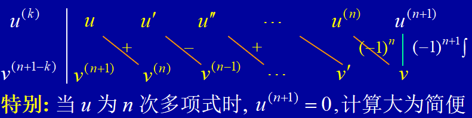

## 不定积分
### 原函数
如果在区间\( I \)上，可导函数\( F(x) \)的导数为\( f(x) \)，即对任一\( x \in I \)，都有
\[ F'(x) = f(x) \ \text{或} \ \mathrm{d}F(x) = f(x)\mathrm{d}x \]
那么函数\( F(x) \)就称为\( f(x) \)在区间\( I \)上的**原函数**
### 原函数存在定理
如果函数\( f(x) \)在区间\( I \)上连续，那么在\( I \)上存在可导函数\( F(x) \)，使对任一\( x \in I \)都有
\[ F'(x) = f(x) \]

- **连续函数一定有原函数**

### 不定积分的定义
在区间\( I \)上，函数\( f(x) \)的带有任意常数项的原函数称为\( f(x) \)（或\( f(x)\mathrm{d}x \)）在区间\( I \)上的**不定积分**，记作\( \int f(x)\mathrm{d}x \)。其中：
- \( \int \) —— 积分号
- \( f(x) \) —— 被积函数
- \( f(x)\mathrm{d}x \) —— 被积表达式
- \( x \) —— 积分变量

若\( F(x) \)是\( f(x) \)在区间\( I \)上的原函数，则
\[
\int f(x)\mathrm{d}x = F(x) + C
\]
- 积分曲线是一簇平行曲线，它们在横坐标相同的点的切线平行
- 积分运算与微分运算是互逆运算
### 不定积分公式⭐
常用积分表：
1. \[ \int k\mathrm{d}x = kx + C（ k  为常数） \]

2. \[ \int x^\mu \mathrm{d}x = \frac{x^{\mu+1}}{\mu+1} + C \ (\mu \neq -1) \]

3. \[ \int \frac{1}{x}\mathrm{d}x = \ln|x| + C \]

4. \[ \int \frac{1}{1+x^2}\mathrm{d}x = \arctan x + C \]

5. \[ \int \frac{1}{\sqrt{1-x^2}}\mathrm{d}x = \arcsin x + C \]

6. \[ \int \cos x \mathrm{d}x = \sin x + C \]

7. \[ \int \sin x \mathrm{d}x = -\cos x + C \]

8. \[ \int \sec^2 x \mathrm{d}x = \tan x + C \]

9. \[ \int \csc^2 x \mathrm{d}x = -\cot x + C \]

10. \[ \int \sec x \tan x \mathrm{d}x = \sec x + C \]

11. \[ \int \csc x \cot x \mathrm{d}x = -\csc x + C \]

12. \[ \int e^x \mathrm{d}x = e^x + C \]

13. \[ \int a^x \mathrm{d}x = \frac{a^x}{\ln a} + C \ (a>0, a \neq 1) \]

扩充：

1.  \[ \int \tan x \mathrm{d}x = -\ln|\cos x| + C \]
2.  \[ \int \cot x \mathrm{d}x = \ln|\sin x| + C \]
3.  \[ \int \sec x \mathrm{d}x = \ln|\sec x + \tan x| + C \]
4.  \[ \int \csc x \mathrm{d}x = \ln|\csc x - \cot x| + C \]
5.  \[ \int \frac{\mathrm{d}x}{a^2 + x^2} = \frac{1}{a}\arctan \frac{x}{a} + C \]
6.  \[ \int \frac{\mathrm{d}x}{x^2 - a^2} = \frac{1}{2a}\ln\left| \frac{x - a}{x + a} \right| + C \]
7.  \[ \int \frac{\mathrm{d}x}{\sqrt{a^2 - x^2}} = \arcsin \frac{x}{a} + C \]
8.  \[ \int \frac{\mathrm{d}x}{\sqrt{x^2 + a^2}} = \ln\left( x + \sqrt{x^2 + a^2} \right) + C \]
9.  \[ \int \frac{\mathrm{d}x}{\sqrt{x^2 - a^2}} = \ln\left| x + \sqrt{x^2 - a^2} \right| + C \]
### 不定积分的性质
**性质1** 设函数\( f(x) \)及\( g(x) \)的原函数存在，则
\[
\int [f(x) + g(x)]\mathrm{d}x = \int f(x)\mathrm{d}x + \int g(x)\mathrm{d}x
\]

**性质2** 设函数\( f(x) \)的原函数存在，\( k \)为非零常数，则
\[
\int kf(x)\mathrm{d}x = k\int f(x)\mathrm{d}x
\]

### 第一类换元积分法
设函数\( f(u) \)具有原函数，\( u = \varphi(x) \)，则有换元公式：
\[
\int f[\varphi(x)]\varphi'(x)\mathrm{d}x = \left( \int f(u)\mathrm{d}u \right)_{u=\varphi(x)}
\]

**换元公式的应用步骤**
1. **分解**：将\( g(x) \)拆分为\( f(\varphi(x))\varphi'(x) \)（此步骤是关键难点）；
2. **凑微分**：将\( \varphi'(x)\mathrm{d}x \)凑成微分形式\( \mathrm{d}\varphi(x) = \mathrm{d}u \)；
3. **计算**：计算不定积分\( \int f(u)\mathrm{d}u \)（要求该积分易求出）。
#### 常用的凑微分（配元）形式
1. \[ \int f(ax + b)\mathrm{d}x = \frac{1}{a}\int f(ax + b) \mathrm{d}(ax + b) \]
2. \[ \int f(x^n)x^{n-1} \mathrm{d}x = \frac{1}{n}\int f(x^n) \mathrm{d}x^n \]
3. \[ \int f(x^n)\frac{1}{x} \mathrm{d}x = \frac{1}{n}\int f(x^n) \frac{1}{x^n} \mathrm{d}x^n \]
4. \[ \int f(\sin x)\cos x \mathrm{d}x = \int f(\sin x) \mathrm{d}\sin x \]
5. \[ \int f(\cos x)\sin x \mathrm{d}x = -\int f(\cos x) \mathrm{d}\cos x \]
6. \[ \int f(\tan x)\sec^2 x \mathrm{d}x = \int f(\tan x) \mathrm{d}\tan x \]
7. \[ \int f(e^x)e^x \mathrm{d}x = \int f(e^x) \mathrm{d}e^x \]
8. \[ \int f(\ln x)\frac{1}{x} \mathrm{d}x = \int f(\ln x) \mathrm{d}\ln x \]
   
#### 小结 常用简化技巧
1. **拆项积分**：利用积化和差等三角公式拆分被积函数后积分
   1.  \(\sin\alpha \cos\beta = \frac{1}{2}\left[\sin(\alpha+\beta) + \sin(\alpha-\beta)\right]\)
   2.  \(\cos\alpha \sin\beta = \frac{1}{2}\left[\sin(\alpha+\beta) - \sin(\alpha-\beta)\right]\)
   3.  \(\cos\alpha \cos\beta = \frac{1}{2}\left[\cos(\alpha+\beta) + \cos(\alpha-\beta)\right]\)
   4.  \(\sin\alpha \sin\beta = -\frac{1}{2}\left[\cos(\alpha+\beta) - \cos(\alpha-\beta)\right]\)
2. **降低幂次**：利用倍角公式简化高次三角函数，如
   \[
   \cos^2 x = \frac{1}{2}(1 + \cos 2x); \quad \sin^2 x = \frac{1}{2}(1 - \cos 2x)
   \]
   结合万能凑幂法：
   \[
   \begin{cases}
   \int f(x^n)x^{n-1}\mathrm{d}x = \frac{1}{n}\int f(x^n)\mathrm{d}x^n \\
   \int f(x^n)\frac{1}{x}\mathrm{d}x = \frac{1}{n}\int f(x^n)\frac{1}{x^n}\mathrm{d}x^n
   \end{cases}
   \]
3. **统一函数**：利用三角公式将不同类型的三角函数统一为同一类函数后积分。
### 第二类换元积分法
设 \( x = \psi(t) \) 是单调的、可导的函数，并且 \( \psi'(t) \neq 0 \)。又设 \( f[\psi(t)]\psi'(t) \) 具有原函数，则有换元公式：
\[
\int f(x)\mathrm{d}x = \left( \int f[\psi(t)]\psi'(t)\mathrm{d}t \right)_{t=\psi^{-1}(x)}
\]
（其中 \( t = \psi^{-1}(x) \) 是 \( x = \psi(t) \) 的反函数）
- 三角代换
  - \( x = a\sin t \)：用于被积函数中含有 \( \sqrt{a^2 - x^2} \)；
  - \( x = a\tan t \)：用于被积函数中含有 \( \sqrt{x^2 + a^2} \)；
  - \( x = a\sec t \)：用于被积函数中含有 \( \sqrt{x^2 - a^2} \)。
  - 积分中为了化掉根式，是否一定采用三角代换**并不是绝对的**，需根据被积函数的情况来定。
- 倒代换
  - 当分母的阶较高时, 可采用倒代换$x=\dfrac1t$

### 分部积分法

\[
\int u \mathrm{d}v = uv - \int v \mathrm{d}u
\]
- 顺序：反对幂三指（在前的选作u）
- 分部积分题目的类型
  1. **直接分部化简积分**：通过一次分部积分直接简化被积表达式，得出结果；
  2. **分部产生循环式，由此解出积分式**：
     （注意：两次分部选择的 \( u, v \) 函数类型不变，解出积分后需加常数 \( C \)）；
  3. **对含自然数 \( n \) 的积分，通过分部积分建立递推公式**：利用分部积分得到关于 \( n \) 的递推关系，逐步化简积分。
- 表格法

特别适用于含指数函数，三角函数
### 有理函数积分

1. **有理函数** 
\[
R(x) = \frac{P(x)}{Q(x)} = \frac{a_0x^n + a_1x^{n-1} + \cdots + a_n}{b_0x^m + b_1x^{m-1} + \cdots + b_m} \quad (a_0b_0 \neq 0)
\]
称为**有理函数**：
   - 当 \( n < m \) 时，称为**真分式**；
   - 当 \( n \geq m \) 时，称为**假分式**
1. **真分式的分解式**
    对于真分式 \( \frac{P(x)}{Q(x)} \)，若分母可分解为两个无公因式的多项式乘积 \( Q(x)=Q_1(x)Q_2(x) \)，则：
    \[
    \frac{P(x)}{Q(x)} = \frac{P_1(x)}{Q_1(x)} + \frac{P_2(x)}{Q_2(x)}
    \]
    这一过程称为将真分式化成**部分分式之和**。若 \( Q_1(x) \) 或 \( Q_2(x) \) 可继续分解，该过程可重复进行，最终有理函数的分解式仅包含三类函数：
    - 多项式；
    - \( \frac{P_1(x)}{(x-a)^k} \)（\( P_1(x) \) 是次数小于 \( k \) 的多项式）；
    - \( \frac{P_2(x)}{(x^2+px+q)^l} \)（其中 \( p^2-4q<0 \)，\( P_2(x) \) 是次数小于 \( 2l \) 的多项式）。
3. 以下是部分分式对应的积分公式：

   1. \[ \int \frac{A}{x-a}\mathrm{d}x = A\ln|x-a| + C \]

   2. \[ \int \frac{A}{(x-a)^n}\mathrm{d}x = \frac{A}{1-n}(x-a)^{1-n} + C \quad (n \neq 1) \]

   3. \[ \int \frac{Mx+N}{x^2+px+q}\mathrm{d}x \]
      （解法：将分子变形为 \( \frac{M}{2}(2x+p) + N - \frac{Mp}{2} \)，再分项积分）

   4. \[ \int \frac{Mx+N}{(x^2+px+q)^n}\mathrm{d}x \quad (p^2-4q<0, n \neq 1) \]
      （解法：同3，将分子变形后分项积分）
- 三角函数有理式的积分
    - 对于三角函数有理式的积分 \(  \displaystyle\int R(\sin x, \cos x)\mathrm{d}x \)，可通过**万能代换** \( t = \tan \frac{x}{2} \)，将其转化为有理函数的积分。
    \[
    \begin{align*}
    \sin x &= \frac{2\sin \frac{x}{2}\cos \frac{x}{2}}{\sin^2 \frac{x}{2}+\cos^2 \frac{x}{2}} = \frac{2\tan \frac{x}{2}}{1+\tan^2 \frac{x}{2}} = \frac{2t}{1+t^2}, \\
    \cos x &= \frac{\cos^2 \frac{x}{2}-\sin^2 \frac{x}{2}}{\sin^2 \frac{x}{2}+\cos^2 \frac{x}{2}} = \frac{1-\tan^2 \frac{x}{2}}{1+\tan^2 \frac{x}{2}} = \frac{1-t^2}{1+t^2}, \\
    \mathrm{d}x &= \frac{2}{1+t^2}\mathrm{d}t.
    \end{align*}
    \]

    \[
    \int R(\sin x, \cos x)\mathrm{d}x = \int R\left( \frac{2t}{1+t^2}, \frac{1-t^2}{1+t^2} \right) \cdot \frac{2}{1+t^2}\mathrm{d}t
    \]

  - 当求含有 \( \sin^2 x \)、\( \cos^2 x \) 及 \( \sin x\cos x \) 的有理式的积分时，使用代换 \( t = \tan x \) 往往比万能代换更简便。
- 简单无理函数的积分
被积函数为简单根式的有理式时，可通过根式代换化为有理函数的积分
  1. 对于 \(  \displaystyle\int R\left(x, \sqrt[n]{ax+b}\right)\mathrm{d}x \)，令 \( t = \sqrt[n]{ax+b} \)；
  2. 对于 \( \displaystyle\int R\left(x, \sqrt[n]{\dfrac{ax+b}{cx+d}}\right)\mathrm{d}x \)，令 \( t = \sqrt[n]{\dfrac{ax+b}{cx+d}} \)；
  3. 对于 \(  \displaystyle\int R\left(x, \sqrt[n]{ax+b}, \sqrt[m]{ax+b}\right)\mathrm{d}x \)，令 \( t = \sqrt[p]{ax+b} \)（其中 \( p \) 是 \( m,n \) 的最小公倍数）。

## 定积分
### 定积分的定义
设函数 \( f(x) \) 在区间 \( [a,b] \) 上有界，按以下步骤定义定积分：
1. **分割**：在 \( [a,b] \) 中插入分点 \( a = x_0 < x_1 < x_2 < \cdots < x_{n-1} < x_n = b \)，将 \( [a,b] \) 分成 \( n \) 个小区间 \( [x_{i-1},x_i] \)（\( i=1,2,\cdots,n \)），记第 \( i \) 个小区间的长度为 \( \Delta x_i = x_i - x_{i-1} \)；
2. **取点作积**：在每个小区间 \( [x_{i-1},x_i] \) 上任取一点 \( \xi_i \)，作乘积 \( f(\xi_i)\Delta x_i \)；
3. **求和**：作和 \( S = \sum\limits_{i=1}^n f(\xi_i)\Delta x_i \)；
4. **取极限**：记 \( \lambda = \max\{\Delta x_1, \Delta x_2, \cdots, \Delta x_n\} \)，若不论 \( [a,b] \) 如何划分、\( \xi_i \) 如何选取，当 \( \lambda \to 0 \) 时，和 \( S \) 总趋于确定的极限 \( I \)，则称 \( I \) 为函数 \( f(x) \) 在 \( [a,b] \) 上的**定积分**，记作
\[
\int_a^b f(x)\mathrm{d}x = I = \lim_{\lambda \to 0} \sum_{i=1}^n f(\xi_i)\Delta x_i
\]
-  若函数 \( f(x) \) 在区间 \( [a,b] \) 上的定积分存在，则称 \( f(x) \) 在 \( [a,b] \) 上**可积**。
>凑定积分定义：
>提$\dfrac1n \rightarrow$ 凑$\dfrac{i}n\rightarrow$写积分
### 可积的条件
- **连续一定可积**
- 设 \( f(x) \) 在区间 \( [a,b] \) 上有界，且只有有限个间断点，则 \( f(x) \) 在区间 \( [a,b] \) 上可积
### 定积分性质
1. **区间端点相等时的积分**
   当 \( a = b \) 时，\(\displaystyle \int_a^b f(x)\mathrm{d}x = 0\)；

2. **区间反向时的积分**
   当 \( a > b \) 时，\(\displaystyle \int_a^b f(x)\mathrm{d}x = -\int_b^a f(x)\mathrm{d}x\)；
3. **和差性质**
$\displaystyle\int_a^b \left[ f(x) \pm g(x) \right]\mathrm{d}x = \int_a^b f(x)\mathrm{d}x \pm \int_a^b g(x)\mathrm{d}x$
1. **常数因子可提性**
$\displaystyle\int_a^b kf(x)\mathrm{d}x = k\int_a^b f(x)\mathrm{d}x$（\( k \) 为常数）
1. **区间可加性**
$\displaystyle\int_a^b f(x)\mathrm{d}x = \int_a^c f(x)\mathrm{d}x + \int_c^b f(x)\mathrm{d}x$
1. **常函数积分**
    $\displaystyle\int_a^b 1\mathrm{d}x = b - a$
2. **保号性**
如果在区间 \([a,b]\) 上 \( f(x) \geq 0 \)（且 \( a < b \)），则：$\displaystyle\int_a^b f(x)\mathrm{d}x \geq 0$
    - **保序性**
如果在区间 \([a,b]\) 上 \( f(x) \leq g(x) \)（且 \( a < b \)），则：$\displaystyle\int_a^b f(x)\mathrm{d}x \leq \int_a^b g(x)\mathrm{d}x$
    - **积分绝对值不等式**
对区间 \([a,b]\)（\( a < b \)）上的可积函数 \( f(x) \)，有：
$\displaystyle\left| \int_a^b f(x)\mathrm{d}x \right| \leq \int_a^b |f(x)| \mathrm{d}x$
1. **估值定理**
设 \( M \) 和 \( m \) 分别是函数 \( f(x) \) 在区间 \([a,b]\) 上的最大值与最小值，则有：
$\displaystyle m(b - a) \leq \int_a^b f(x)\mathrm{d}x \leq M(b - a)$
1. **定积分中值定理**
若函数 \( f(x) \) 在积分区间 \([a,b]\) 上**连续**，则在 \([a,b]\) 上至少存在一点 \( \xi \)，使得下式成立：$\displaystyle\int_a^b f(x)\mathrm{d}x = f(\xi)(b - a) \quad (a \leq \xi \leq b)$
### 微积分基本公式
1. **积分上限的函数定义**
设函数\( f(x) \)在区间\([a,b]\)上连续，\( x \in [a,b] \)，则定积分\( \int_{a}^{x} f(t)dt \)是积分上限\( x \)的函数，称为**积分上限的函数**，记作：
\[ \varPhi(x) = \int_{a}^{x} f(t)dt \quad (a \leq x \leq b) \]

1. **积分上限函数的性质**
   - 若\( f(x) \)在\([a,b]\)上连续，则积分上限函数\( \varPhi(x) = \int_{a}^{x} f(t)dt \)在\([a,b]\)上可导，且：
  \[ \varPhi'(x) = \frac{d}{dx}\int_{a}^{x} f(t)dt = f(x) \quad (a \leq x \leq b) \]

   - 若\( f(x) \)在\([a,b]\)上连续，则\( \varPhi(x) = \int_{a}^{x} f(t)dt \)是\( f(x) \)在\([a,b]\)上的一个原函数。
1. **牛顿—莱布尼茨公式**
若\( F(x) \)是连续函数\( f(x) \)在\([a,b]\)上的一个原函数，则：
\[ \int_{a}^{b} f(x)dx = F(b) - F(a) \]
1. 积分上限函数的求导公式
\[ 
\begin{align*}  
\left( \int_{a}^{x} f(t)dt \right)' &= f(x) \\
 \left( \int_{x}^{b} f(t)dt \right)' &= -f(x) \\
 \left( \int_{a}^{\varphi(x)} f(t)dt \right)' &= f(\varphi(x)) \cdot \varphi'(x) \\
 \left( \int_{\psi(x)}^{\varphi(x)} f(t)dt \right)' &= f(\varphi(x)) \cdot \varphi'(x) - f(\psi(x)) \cdot \psi'(x) 
 \end{align*}  
 \]
### 定积分的换元法和分部积分法
#### 定积分的换元法
**定理**：设函数\( f(x) \)在\([a,b]\)上连续，函数\( x = \varphi(t) \)满足：
1. \( \varphi(\alpha) = a \)，\( \varphi(\beta) = b \)；
2. \( \varphi(t) \)在\([\alpha,\beta]\)上有连续导数，且值域\( R_\varphi = [a,b] \)；

则定积分换元公式为：
\[ \int_{a}^{b} f(x)dx = \int_{\alpha}^{\beta} f[\varphi(t)]\varphi'(t)dt \]

#### 几点说明
1. 换元必换限：用\( x = \varphi(t) \)换元时，积分限需同步替换为新变量\( t \)的范围；
2. 无需回代：求出\( f[\varphi(t)]\varphi'(t) \)的原函数\( \varPhi(t) \)后，直接计算\( \varPhi(\beta) - \varPhi(\alpha) \)即可；
3. 与不定积分换元的关系：换元公式对应不定积分第二换元法；
- 若\( f(x) \)在\([-a,a]\)上连续且为偶函数，则
\[ \int_{-a}^{a} f(x)dx = 2\int_{0}^{a} f(x)dx \]

- 若\( f(x) \)在\([-a,a]\)上连续且为奇函数，则
\[ \int_{-a}^{a} f(x)dx = 0 \]

- \( \displaystyle\int_{0}^{\frac{\pi}{2}} f(\sin x) \mathrm{d}x = \int_{0}^{\frac{\pi}{2}} f(\cos x) \mathrm{d}x \)
- \( \displaystyle\int_{0}^{\pi} x f(\sin x) \mathrm{d}x = \frac{\pi}{2} \int_{0}^{\pi} f(\sin x) \mathrm{d}x\)

- \(\displaystyle\int_{a}^{a+T} f(x) \mathrm{d}x = \int_{0}^{T} f(x) \mathrm{d}x\);
- \(\displaystyle\int_{a}^{a+nT} f(x) \mathrm{d}x = n\int_{0}^{T} f(x) \mathrm{d}x (n \in \mathrm{N}),\)
#### 定积分的分部积分法
\[ \int_{a}^{b} u\mathrm{d}v = \left[ uv \right]_{a}^{b} - \int_{a}^{b} v\mathrm{d}u \]
点火公式：
\[
\begin{align*}
I_{n}&=\int_{0}^{\frac{\pi}{2}}\sin^{n}x\mathrm{d}x=\int_{0}^{\frac{\pi}{2}}\cos^{n}x\mathrm{d}x\\
&=\begin{cases}
\dfrac{n-1}{n}\cdot\dfrac{n-3}{n-2}\cdots\dfrac{3}{4}\cdot\dfrac{1}{2}\cdot\dfrac{\pi}{2},\ &n为正偶数,\\
\dfrac{n-1}{n}\cdot\dfrac{n-3}{n-2}\cdots\dfrac{4}{5}\cdot\dfrac{2}{3},\ &n为大于1的正奇数.
\end{cases}
\end{align*}
\]
### 反常积分
#### 一、无穷区间的反常积分
- **定义**：设函数\( f(x) \)在区间\([a, +\infty)\)上连续，取\( t > a \)，如果极限\( \lim\limits_{t \to +\infty} \int_{a}^{t} f(x)dx \)存在，则称此极限为函数\( f(x) \)在无穷区间\([a, +\infty)\)上的反常积分，记作\( \int_{a}^{+\infty} f(x)dx \)，即
\[ \int_{a}^{+\infty} f(x)dx = \lim\limits_{t \to +\infty} \int_{a}^{t} f(x)dx \]
此时也称反常积分收敛，如果极限不存在，则称发散。

- **计算方法**：设\( F(x) \)是\( f(x) \)的一个原函数：
  1. 区间\([a, +\infty)\)：
  \[ \int_{a}^{+\infty} f(x)dx = \lim_{x \to +\infty} F(x) - F(a) = \left[ F(x) \right]_{a}^{+\infty} \]

  1. 区间\((-\infty, b]\)：
  \[ \int_{-\infty}^{b} f(x)dx = F(b) - \lim_{x \to -\infty} F(x) = \left[ F(x) \right]_{-\infty}^{b} \]

  1. 区间\((-\infty, +\infty)\)：
  \[ \int_{-\infty}^{+\infty} f(x)dx = \lim_{x \to +\infty} F(x) - \lim_{x \to -\infty} F(x) = \left[ F(x) \right]_{-\infty}^{+\infty} \]

#### 二、无界函数的反常积分（瑕积分）
- **瑕点**：函数在某点任一邻域内无界，则该点称为瑕点。

- **定义（3种情况）**：
  1. \( f(x) \)在\((a, b]\)连续，\( a \)为瑕点：
  \[ \int_{a}^{b} f(x)dx = \lim_{t \to a^{+}} \int_{t}^{b} f(x)dx \]

  2. \( f(x) \)在\([a, b)\)连续，\( b \)为瑕点：
  \[ \int_{a}^{b} f(x)dx = \lim_{t \to b^{-}} \int_{a}^{t} f(x)dx \]

  3. \( f(x) \)在\([a, b]\)除\( c \in (a,b) \)外连续，\( c \)为瑕点：
  \[ \int_{a}^{b} f(x)dx = \lim_{t \to c^{-}} \int_{a}^{t} f(x)dx + \lim_{t \to c^{+}} \int_{t}^{b} f(x)dx \]

- **瑕积分的牛顿—莱布尼茨公式**：
  设\( F(x) \)是\( f(x) \)的原函数：
  1. \( b \)为瑕点：\( \displaystyle\int_{a}^{b} f(x)dx = F(b^{-}) - F(a) \)
  2. \( a \)为瑕点：\( \displaystyle\int_{a}^{b} f(x)dx = F(b) - F(a^{+}) \)
  3. \( a,b \)均为瑕点：\( \displaystyle\int_{a}^{b} f(x)dx = F(b^{-}) - F(a^{+}) \)
  4. 瑕点\( c \in (a,b) \)：\( \displaystyle\int_{a}^{b} f(x)dx = F(b) - F(c^{+}) + F(c^{-}) - F(a) \)

（注：以上反常积分，极限存在则**收敛**，否则**发散**）

## 定积分的应用
### 元素法
1. **选取积分变量**
选择一个变量（例如\( x \)）作为积分变量，确定其变化区间\([a,b]\)；

1. **求元素**
将区间\([a,b]\)分成\( n \)个小区间，取任一小区间\([x, x+\Delta x]\)，求出对应部分量\(\Delta U\)的近似值（即\( U \)的元素）：
\[ dU = f(x)dx \]

1. **构造定积分**
\[ U = \int_{a}^{b} f(x)dx \]
### 定积分在几何学上的应用

#### 一、平面图形的面积
##### 1. 直角坐标系下
- **X型区域**（由\( y=f(x) \)、\( y=g(x) \)（\( f(x)\geq g(x) \)）、\( x=a \)、\( x=b \)围成）：
\[ S = \int_{a}^{b} \left[ f(x) - g(x) \right] dx \]

- **Y型区域**（由\( x=\varphi(y) \)、\( x=\psi(y) \)（\( \varphi(y)\geq \psi(y) \)）、\( y=c \)、\( y=d \)围成）：
\[ S = \int_{c}^{d} \left[ \varphi(y) - \psi(y) \right] dy \]

##### 2. 极坐标系下
（由曲线\( r=\rho(\theta) \)、极角\( \theta=\alpha \)、\( \theta=\beta \)围成的扇形区域）：
\[ S = \frac{1}{2} \int_{\alpha}^{\beta} \rho^{2}(\theta) d\theta \]

#### 二、平面曲线的弧长
##### 1. 直角坐标系下
（曲线\( y=f(x) \)，\( x\in[a,b] \)，\( f(x) \)可导）：
\[ L = \int_{a}^{b} \sqrt{1 + \left[ f'(x) \right]^{2}} dx \]

##### 2. 参数方程形式
（曲线\( \begin{cases} x=\varphi(t) \\ y=\psi(t) \end{cases} \)，\( t\in[\alpha,\beta] \)，\( \varphi'(t)、\psi'(t) \)连续）：
\[ L = \int_{\alpha}^{\beta} \sqrt{\left[ \varphi'(t) \right]^{2} + \left[ \psi'(t) \right]^{2}} dt \]

##### 3. 极坐标形式
（曲线\( r=\rho(\theta) \)，\( \theta\in[\alpha,\beta] \)，\( \rho'(\theta) \)连续）：
\[ L = \int_{\alpha}^{\beta} \sqrt{\rho^{2}(\theta) + \left[ \rho'(\theta) \right]^{2}} d\theta \]

#### 三、旋转体的体积
##### 1. 绕X轴旋转
（由\( y=f(x) \)、\( x=a \)、\( x=b \)、\( x \)轴围成的图形）：
\[ V_{x} = \pi \int_{a}^{b} \left[ f(x) \right]^{2} dx \]

##### 2. 绕Y轴旋转
- **方法1（圆盘法）**：由\( x=\varphi(y) \)、\( y=c \)、\( y=d \)、\( y \)轴围成的图形：
\[ V_{y} = \pi \int_{c}^{d} \left[ \varphi(y) \right]^{2} dy \]

- **方法2（柱壳法）**：由\( y=f(x) \)、\( x=a \)、\( x=b \)、\( x \)轴围成的图形：
\[ V_{y} = 2\pi \int_{a}^{b} x \cdot f(x) dx \]
