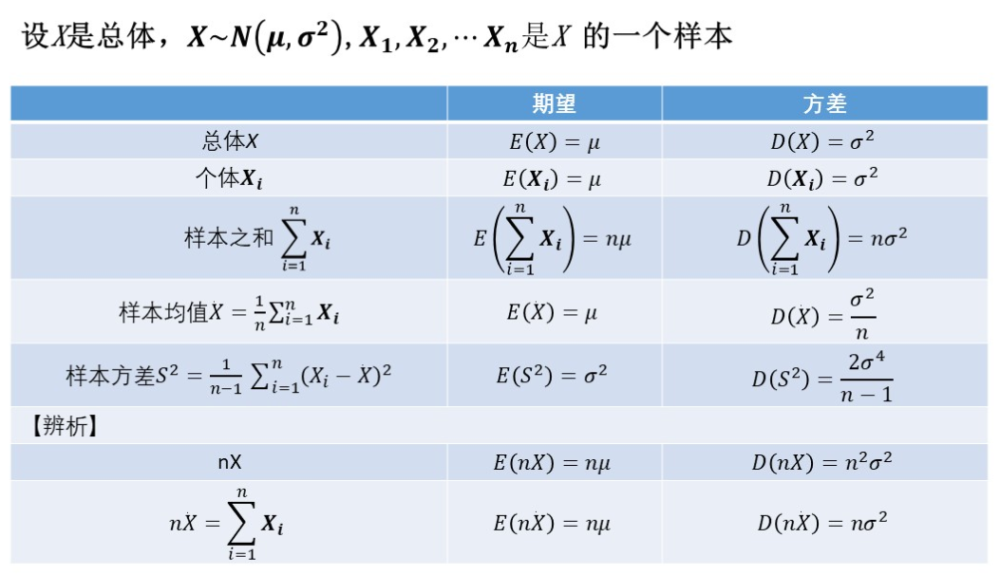
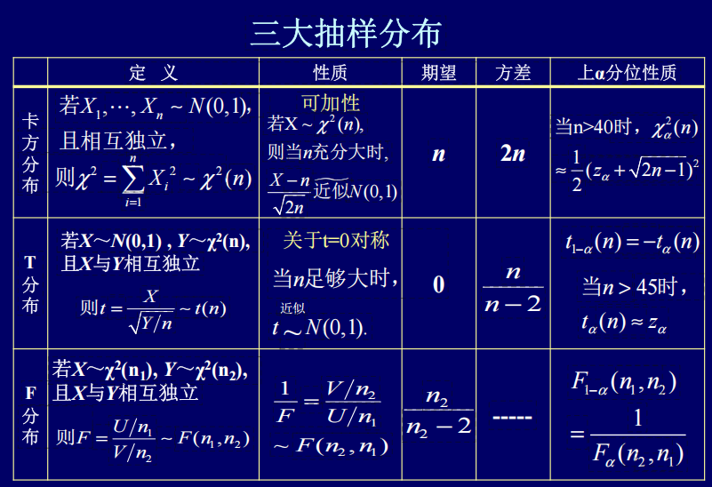
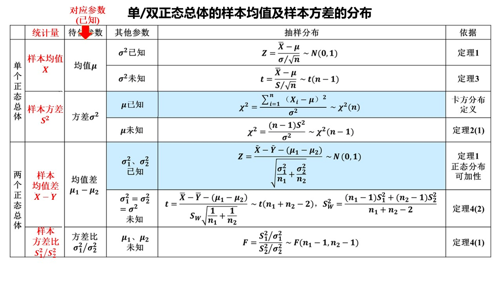

# 第六章 数理统计基础 整理笔记

## 6.1 随机样本
### 一、数理统计概述
1. 概率论与数理统计的关系
   - **概率论**：总体分布已知，通过演绎推理研究随机变量的性质与统计规律
   - **数理统计**：总体分布未知/部分未知，通过样本数据归纳推断总体的分布与特征
   - 关系：概率论是数理统计的理论基础，数理统计是概率论的重要应用

2. 数理统计的研究内容
   1. **有效收集数据**
       - 方法：普查、抽样调查、试验设计
       - 抽样方式：简单随机抽样、分层抽样、等距抽样、整群抽样等
       - 核心要求：数据必须具有随机性
   2. **有效使用数据**
       - 建立统计模型，制定推断方法的评判准则
       - 核心方向：参数估计、假设检验、方差分析、回归分析

3. 数理统计的分类
   - **描述统计学**：对数据进行收集、整理、可视化与概括分析，研究数据的集中趋势、离中趋势与相关关系
   - **推断统计学**：基于样本数据推断总体的未知数量特征，分为**参数估计**和**假设检验**两大类

4. 方法本质
统计方法是归纳式推理，结论具有不确定性；统计学的核心作用是提供归纳推理的方法，并量化结论的不确定程度。

### 二、总体与样本
1. 总体
   - 定义：研究对象的全体称为**总体**，每个研究对象称为**个体**，总体包含的个体数目称为**总体容量**
   - 分类：有限总体、无限总体；容量极大的有限总体可近似按无限总体处理
   - 统计意义：总体等价于一个概率分布，用随机变量\(X\)（或其分布函数\(F(x)\)）表示；研究总体本质是研究该随机变量的分布与数字特征

2. 简单随机样本
   - 抽样：从总体中抽取部分个体以获取总体信息的过程，抽取的个体称为**样本**，样本包含的个体数称为**样本容量\(n\)**
   - **简单随机样本定义**：若随机变量\(X_1,X_2,\dots,X_n\)相互独立，且与总体\(X\)服从同一分布，则称其为来自总体\(X\)的容量为\(n\)的简单随机样本，简称样本
   - 简单随机抽样的核心性质
     - **代表性**：每个样本都与总体具有相同的分布
     - **独立性**：样本之间相互独立

3. 样本的双重性
   - 观测前：是\(n\)个独立同分布的随机变量
   - 观测后：是\(n\)个确定的数值，称为**样本值**\(x_1,x_2,\dots,x_n\)

4. 样本的联合分布
   若总体分布函数为\(F(x)\)，概率密度为\(f(x)\)，则简单随机样本的：
   - 联合分布函数：$\displaystyle F(x_1,x_2,\dots,x_n)=\prod_{i=1}^n F(x_i)$
   - 联合概率密度：$\displaystyle f(x_1,x_2,\dots,x_n)=\prod_{i=1}^n f(x_i)$

5. 抽样的工程实现
   - 有限总体：放回抽样可得到严格的简单随机样本；当总体容量\(N\)远大于样本容量\(n\)时，不放回抽样可近似为放回抽样
   - 无限总体：均采用不放回抽样

6. 三者的逻辑关系
总体分布决定样本的取值规律，样本是连接总体与样本值的桥梁；统计推断的核心特征是**用部分样本推断整体总体**。

## 6.2 直方图和箱线图
### 一、频率直方图
1. 作用：直观展示数值型数据的分布形态，当样本量足够大时，其外轮廓可近似代替总体的概率密度曲线。

2. 绘制步骤
   1. **确定区间**：找出数据的最小值、最大值，取端点比数据精度高一位的区间，避免数据落在分点上
   2. **分组定组距**：将区间等分为\(k\)个小区间，组距\(\Delta=\frac{\text{区间总长度}}{k}\)
      - 样本量\(n\ge50\)时，\(k\)取10\~20；\(n<50\)时，\(k\)取5\~6
   3. **统计频数**：计算每个小区间内的数据个数\(f_i\)，并计算对应频率\(f_i/n\)
   4. 绘图：以小区间为底边，以\(\dfrac{f_i}{n}/\Delta\)为高绘制矩形，即频率直方图

3. 核心性质
   - 每个小矩形的面积 = 数据落在该区间的频率
   - **样本量\(n\)越大，频率越趋近于概率**，直方图越接近总体概率密度曲线

### 二、箱线图
1. 基础：样本分位数
   - 定义：将容量为\(n\)的样本从小到大排序为\(x_{(1)}\le x_{(2)}\le \dots \le x_{(n)}\)，\(p\)分位数\(x_p\)满足：至少\(np\)个观测值小于等于\(x_p\)，至少\(n(1-p)\)个观测值大于等于\(x_p\)
   - 计算法则
     - 若\(np\)不是整数：\(x_p = x_{(\lfloor np \rfloor +1)}\)（取向上取整位置的数值）
     - 若\(np\)是整数：\(x_p = \frac{1}{2}\left[x_{(np)} + x_{(np+1)}\right]\)
   - 常用分位数
     - 中位数\(M=x_{0.5}\)：描述数据的中心位置
     - 第一四分位数\(Q_1=x_{0.25}\)
     - 第三四分位数\(Q_3=x_{0.75}\)

2. 箱线图的构成与绘制
   - 基于5个特征值：最小值$Min$、第一四分位数\(Q_1\)、中位数\(M\)、第三四分位数\(Q_3\)、最大值$Max$
   - 绘制方法
     1. 绘制水平数轴，标注5个特征值的位置
     2. 绘制矩形箱子，左右边界对应\(Q_1\)和\(Q_3\)，箱子内部绘制中位数的垂直线
     3. 从箱子左右两侧分别引水平线段，延伸至最小值和最大值

3. 信息解读
   - 中心位置：中位数反映数据集的中心
   - 离散程度：箱子、须线越短，对应区间数据越集中；反之越分散
   - 分布偏态：中位数在箱子中间则分布对称；最小值离中位数更远为左偏，最大值离中位数更远为右偏
   - 优势：适合在同一数轴上对比多组数据的分布差异

4. 疑似异常值与修正箱线图
   - 四分位数间距：\(IQR = Q_3 - Q_1\)
   - 异常值判定规则：数据小于\(Q_1 - 1.5IQR\)，或大于\(Q_3 + 1.5IQR\)，判定为疑似异常值
   - 修正箱线图：用特殊标记标出异常值，须线延伸至去除异常值后的最值

5. 异常值的成因与处理
   - 常见成因：测量/记录/输入错误、数据来自不同总体、正确但小概率的观测值
   - 处理建议：无法解释成因时，选用稳健统计方法（如用中位数代替均值）降低异常值对结论的影响

## 6.3 抽样分布
### 一、统计量
#### 1. 统计量核心定义
- 本质：**不含任何未知参数**的样本函数，仅由样本$X_1,X_2,\dots,X_n$决定，用于集中样本信息、推断总体特征。
- 严格定义：设$X_1,X_2,\dots,X_n$是来自总体$X$的样本，若函数$g(X_1,X_2,\dots,X_n)$中无未知参数，则称其为**统计量**；代入样本观测值$x_1,x_2,\dots,x_n$得到$g(x_1,x_2,\dots,x_n)$，为统计量的**观测值**。
- 判定规则：只要含**未知总体参数**（如$\mu、\sigma^2$未知），就不是统计量；参数已知则可包含。

#### 2. 顺序统计量
- 定义：将样本$X_1,\dots,X_n$从小到大排序得$X_{(1)}\leq X_{(2)}\leq\cdots\leq X_{(n)}$，称为**顺序统计量**。
- 核心类型：
  - 最小顺序统计量：$X_{(1)}=\min\{X_1,X_2,\dots,X_n\}$
  - 最大顺序统计量：$X_{(n)}=\max\{X_1,X_2,\dots,X_n\}$
  - 极差：$R_n=X_{(n)}-X_{(1)}$（反映样本离散程度）
  - 样本中位数：
    $$m_{0.5}=\begin{cases}X_{\left(\frac{n+1}{2}\right)} & n\text{为奇数} \\ \frac{1}{2}\left(X_{\left(\frac{n}{2}\right)}+X_{\left(\frac{n}{2}+1\right)}\right) & n\text{为偶数}\end{cases}$$

#### 4. 常用统计量
1. 样本均值
    $\displaystyle\overline{X}=\frac{1}{n}\sum_{i=1}^n X_i$
    - 含义：反映**总体均值**信息
    - 数字特征：$E(\overline{X})=\mu$，$D(\overline{X})=\dfrac{\sigma^2}{n}$

2. 样本方差
$$S^2=\frac{1}{n-1}\sum_{i=1}^n (X_i-\overline{X})^2=\frac{1}{n-1}\left(\sum_{i=1}^n X_i^2-n\overline{X}^2\right)$$
   - 样本标准差：$S=\sqrt{S^2}$

3. 样本矩
   - 样本$k$阶原点矩：$A_k=\displaystyle\frac{1}{n}\sum_{i=1}^n X_i^k$（$k=1,2,\dots$），
  反映总体$k$阶原点矩
   - 样本$k$阶中心矩：$B_k=\displaystyle\frac{1}{n}\sum_{i=1}^n (X_i-\overline{X})^k$（$k=2,3,\dots$），
  反映总体$k$阶中心矩

#### 5. 关键辨析
1. 样本方差$S^2$ vs 样本2阶中心矩$B_2$
   - $B_2=\displaystyle\frac{1}{n}\sum(X_i-\overline{X})^2$（分母$n$，**有偏估计**）
   - $S^2=\displaystyle\frac{1}{n-1}\sum(X_i-\overline{X})^2$（分母$n-1$，**无偏估计**）
   - 期望：$E(S^2)=\sigma^2$，$\displaystyle E(B_2)=\frac{n-1}{n}\sigma^2$
   - 大样本下：$n\to\infty$，$S^2\approx B_2$

2. 无偏性证明（完整推导）
    $$\begin{align*}
    E(S^2)&=\frac{1}{n-1}\left[\sum E(X_i^2)-nE(\overline{X}^2)\right] \\
    E(X_i^2)&=D(X_i)+(EX_i)^2=\sigma^2+\mu^2 \\
    E(\overline{X}^2)&=D(\overline{X})+(E\overline{X})^2=\frac{\sigma^2}{n}+\mu^2 \\
    \Rightarrow E(S^2)&=\frac{1}{n-1}\left[n(\sigma^2+\mu^2)-n\left(\frac{\sigma^2}{n}+\mu^2\right)\right]=\sigma^2
    \end{align*}$$

3. 自由度详解
   - 定义：能**自由取值的变量个数**
   - 样本方差自由度为$n-1$：样本均值$\overline{X}$是约束条件，已知$\overline{X}$时，只需$n-1$个样本值即可确定全部数据
   - 直观类比：总体均值$\mu$已知时，方差分母为$n$（自由度$n$）；$\mu$未知用$\overline{X}$替代，自由度减1

4. 矩估计理论依据
   - 辛钦大数定律：若总体$k$阶矩$E(X^k)=\mu_k$存在，则$n\to\infty$时，$A_k=\displaystyle\frac{1}{n}\sum X_i^k\stackrel{P}{\to}\mu_k$
   - 推广：连续函数$g(A_1,A_2,\dots,A_k)\stackrel{P}{\to}g(\mu_1,\mu_2,\dots,\mu_k)$

### 二、经验分布函数
#### 1. 严格定义
设$X_1,\dots,X_n$是总体$F(x)$的样本，$s(x)$为样本中不大于$x$的个数，则经验分布函数：
$$F_n(x)=\frac{1}{n}s(x) \quad (-\infty<x<\infty)$$

#### 2. 观测值计算步骤
1. 样本值排序：$x_{(1)}\leq x_{(2)}\leq\cdots\leq x_{(n)}$
2. 统计频数、计算频率
3. 求累积频率，写分段函数

#### 3. 观测值分段公式
$$F_n(x)=\begin{cases}
0 & x<x_{(1)} \\
\dfrac{k}{n} & x_{(k)}\leq x<x_{(k+1)} \ (k=1,2,\dots,n-1) \\
1 & x\geq x_{(n)}
\end{cases}$$

#### 4. 经验分布函数三大性质
1. 对每组样本观测值，$F_n(x)$是标准分布函数
2. 固定$x$时，$F_n(x)$是统计量（随机变量）
3. $n$越大，$F_n(x)$与$F(x)$偏差越小

### 三、三大抽样分布
#### $\chi^2$分布（卡方分布）
1. **定义**
$X_1,X_2,\dots,X_n$相互独立且$X_i\sim N(0,1)$，则：
$\displaystyle\chi^2=\sum_{i=1}^n X_i^2\sim\chi^2(n)$
$n$为**自由度**。

2. 概率密度
$$ f(x)=\begin{cases}
\ \displaystyle \frac{1}{2^{n/2}\Gamma(n/2)}x^{\frac{n}{2}-1}e^{-\frac{x}{2}} & x\geq0 \\
0 & x<0
\end{cases}$$
   - 本质：$\chi^2(n)\sim\Gamma\left(\frac{n}{2},2\right)$，$\chi^2(1)\sim\Gamma\left(\frac{1}{2},2\right)$

3. 核心性质
   1. **可加性**：$\chi_1^2\sim\chi^2(n_1)$，$\chi_2^2\sim\chi^2(n_2)$且**独立**，则$\chi_1^2+\chi_2^2\sim\chi^2(n_1+n_2)$
   2. **一般正态转换**：$X_i\sim N(\mu,\sigma^2)$独立，则$\displaystyle\frac{\sum(X_i-\mu)^2}{\sigma^2}\sim\chi^2(n)$
   3. **数字特征**：$E(\chi^2(n))=n$，$D(\chi^2(n))=2n$
   4. **渐近正态**：$n\to\infty$时，$\displaystyle\frac{\chi^2(n)-n}{\sqrt{2n}}\stackrel{近似}{\sim}N(0,1)$

4. 上$\alpha$分位点
   - 定义：$P\{\chi^2>\chi^2_\alpha(n)\}=\alpha$
   - 近似公式（$n>40$）：$\displaystyle\chi^2_\alpha(n)\approx\frac{1}{2}\left(z_\alpha+\sqrt{2n-1}\right)^2$

#### $t$分布
1. **定义**
$X\sim N(0,1)$，$Y\sim\chi^2(n)$，且$X、Y$独立，则：
$\displaystyle t=\frac{X}{\sqrt{Y/n}}\sim t(n)$

1. 概率密度
$$h(t)=\frac{\Gamma\left(\frac{n+1}{2}\right)}{\Gamma\left(\frac{n}{2}\right)\sqrt{n\pi}}\left(1+\frac{t^2}{n}\right)^{-\frac{n+1}{2}} \quad (-\infty<t<\infty)$$

1. 核心性质
   1. **对称性**：关于$t=0$对称，$h(-t)=h(t)$
   2. **渐近正态**：$n\to\infty$时，$t(n)\stackrel{近似}{\sim}N(0,1)$
   3. **特例**：$n=1$时为**柯西分布**，无期望方差
   4. **数字特征**：$E(t)=0\ (n>1)$，$D(t)=\displaystyle\frac{n}{n-2}\ (n>2)$

2. 上$\alpha$分位点
- 定义：$P\{t>t_\alpha(n)\}=\alpha$
- 对称性质：$t_{1-\alpha}(n)=-t_\alpha(n)$
- 近似（$n>45$）：$t_\alpha(n)\approx z_\alpha$（标准正态分位点）

#### $F$分布
1. 定义
$U\sim\chi^2(n_1)$，$V\sim\chi^2(n_2)$，且$U、V$独立，则：
$F=\dfrac{U/n_1}{V/n_2}\sim F(n_1,n_2)$
$n_1$：第一自由度，$n_2$：第二自由度。

2. 核心性质
   1. **倒数性质**：$\displaystyle\frac{1}{F}\sim F(n_2,n_1)$
   2. **数字特征**：$E(F)=\displaystyle\frac{n_2}{n_2-2}\ (n_2>2)$，与$n_1$无关
   3. 与$t$分布关系：$X\sim t(n)$，则$X^2\sim F(1,n)$；$Y=\displaystyle\frac{1}{X^2}\sim F(n,1)$

3. 上$\alpha$分位点
   - 定义：$P\{F>F_\alpha(n_1,n_2)\}=\alpha$
   - 核心公式：$\displaystyle F_{1-\alpha}(n_1,n_2)=\frac{1}{F_\alpha(n_2,n_1)}$

### 四、正态总体四大抽样分布定理
#### （一）单个正态总体$X\sim N(\mu,\sigma^2)$
**定理1（样本均值分布，$\sigma^2$已知）**
- 结论：$\overline{X}\sim N\left(\mu,\frac{\sigma^2}{n}\right)$，标准化得$\displaystyle\frac{\overline{X}-\mu}{\sigma/\sqrt{n}}\sim N(0,1)$
- 应用：已知总体方差时，计算样本均值的概率

**定理2（样本方差分布，核心）**
- 结论1：$\displaystyle\frac{(n-1)S^2}{\sigma^2}\sim\chi^2(n-1)$
- 结论2：$\overline{X}$与$S^2$**相互独立**

**定理3（样本均值分布，$\sigma^2$未知）**
- 结论：$\displaystyle\frac{\overline{X}-\mu}{S/\sqrt{n}}\sim t(n-1)$
- 推导：结合定理1、2，用$S$替代$\sigma$，满足$t$分布定义

#### （二）两个独立正态总体
$X\sim N(\mu_1,\sigma_1^2)$，$Y\sim N(\mu_2,\sigma_2^2)$
**定理4（双总体抽样分布）**
1. **方差比分布**：$\displaystyle\frac{S_1^2/\sigma_1^2}{S_2^2/\sigma_2^2}\sim F(n_1-1,n_2-1)$
   - 应用：检验两个正态总体的方差比
2. **均值差分布（$\sigma_1^2=\sigma_2^2=\sigma^2$）**：
   $$\frac{(\overline{X}-\overline{Y})-(\mu_1-\mu_2)}{S_W\sqrt{\displaystyle\frac{1}{n_1}+\frac{1}{n_2}}}\sim t(n_1+n_2-2)$$
   其中合并方差：$S_W=\displaystyle\sqrt{\frac{(n_1-1)S_1^2+(n_2-1)S_2^2}{n_1+n_2-2}}$

