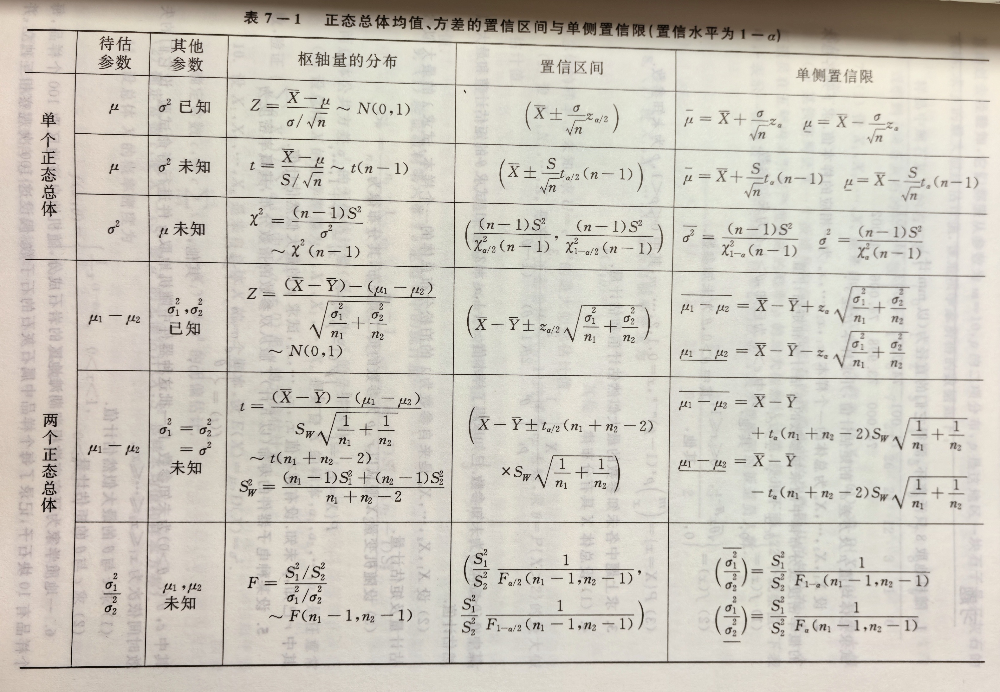
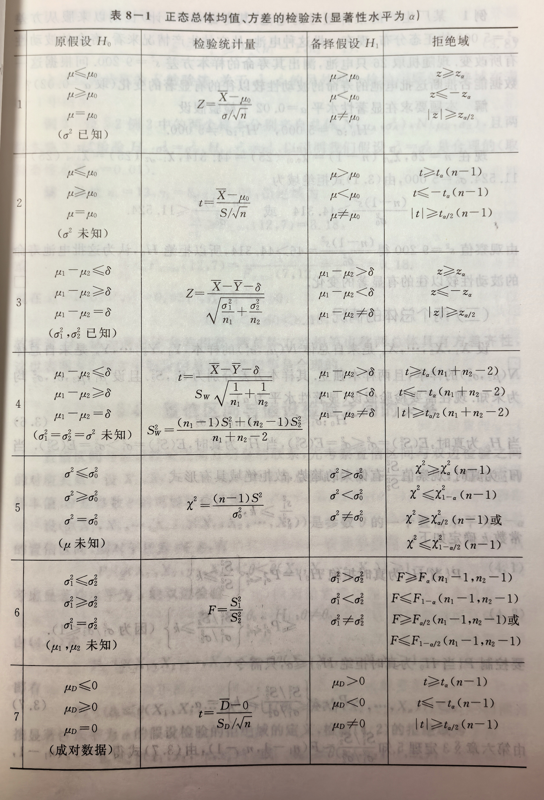

### 一、期望与方差
#### 1. 常用分布期望与方差
   
| 分布     | 记号                     | 概率分布/密度                                                                     | \(E(X)\)                  | \(D(X)\)                        |
| :------- | :----------------------- | :-------------------------------------------------------------------------------- | :------------------------ | :------------------------------ |
| 0-1分布  | \(B(1,p)\)               | \(P(X=k)=p^k(1-p)^{1-k}\)                                                         | \(p\)                     | \(p(1-p)\)                      |
| 二项分布 | \(B(n,p)\)               | \(P(X=k)=C^k_n p^k(1-p)^{n-k}\)                                                   | \(np\)                    | \(np(1-p)\)                     |
| 泊松分布 | \(P(\lambda)\)           | \(P(X=k)=\dfrac{\lambda^k e^{-\lambda}}{k!}\)                                     | \(\lambda\)               | \(\lambda\)                     |
| 均匀分布 | \(U(a,b)\)               | \(f(x)=\dfrac{1}{b-a}, a<x<b\)                                                    | \(\dfrac{a+b}{2}\)        | \(\dfrac{(b-a)^2}{12}\)         |
| 指数分布 | \(E(\theta)/E(\lambda)\) | \(f(x)=\dfrac{1}{\theta}e^{-x/\theta}, x>0\)\(f(x)={\lambda}e^{-\lambda x}, x>0\) | \(\theta/\dfrac1\lambda\) | \(\theta^2/\dfrac1{\lambda^2}\) |
| 正态分布 | \(N(\mu,\sigma^2)\)      | \(f(x)=\frac{1}{\sqrt{2\pi}\sigma}e^{-\frac{(x-\mu)^2}{2\sigma^2}}\)              | \(\mu\)                   | \(\sigma^2\)                    |

- 柯西分布**无期望方差**
#### 2. 期望与方差的性质
**期望**

1. 常数的期望：\(E(C)=C\)
2. 数乘性质：\(E(kX)=kE(X)\)
3. 和的性质：\(E(X+Y)=E(X)+E(Y)\)（**不要求独立**）
    推广：\(\displaystyle E\left(\sum_{i=1}^nX_i\right)=\sum_{i=1}^nE(X_i)\)
4. 积的性质：\(X,Y\)独立\(\Rightarrow E(XY)=E(X)E(Y)\)
    推广：独立变量乘积的期望=期望的乘积

**方差**
1. 常数：\(D(C)=0\)
2. 数乘与平移：$D(CX)=C^2D(X),\quad D(X+C)=D(X)$
3. 和的方差（通用）：$D(X+Y)=D(X)+D(Y)+2\text{Cov}(X,Y)$

4. **独立**时：$D(X+Y)=D(X)+D(Y)$
5. 推广：独立随机变量线性组合$D\left(\sum C_iX_i\right)=\sum C_i^2D(X_i)$
6. 充要条件：\(D(X)=0\iff P\{X=E(X)\}=1\)
   
**协方差**

1. \(\text{Cov}(X,Y)=E\left\{[X-E(X)][Y-E(Y)]\right\}\)
2. 对称性：\(\text{Cov}(X,Y)=\text{Cov}(Y,X)\)
3. 数乘性：\(\text{Cov}(aX,bY)=ab\cdot\text{Cov}(X,Y)\)
4. 可加性：\(\text{Cov}(X_1+X_2,Y)=\text{Cov}(X_1,Y)+\text{Cov}(X_2,Y)\)
5. $\text{Cov}(X,Y)=E(XY)-E(X)E(Y)$

### 二、大数定律与中心极限定理

#### 1. 依概率收敛
\[
Y_n \xrightarrow{P} a \iff \lim_{n\to\infty} P\{|Y_n - a| < \varepsilon\} = 1, \quad \forall \varepsilon > 0
\]

#### 2. 切比雪夫不等式（任意分布，需期望和方差存在）
\[
P\{|X-\mu| \ge \varepsilon\} \le \frac{\sigma^2}{\varepsilon^2}
\]

#### 3. 大数定律
- **切比雪夫大数定律**（不同分布，期望方差存在、方差有界）：
\[
\frac{1}{n}\sum_{k=1}^n X_k \xrightarrow{P} \frac{1}{n}\sum_{k=1}^n E(X_k)
\]
- **辛钦大数定律**（独立同分布，期望存在）：
\[
\overline{X} = \frac{1}{n}\sum_{i=1}^n X_i \xrightarrow{P} \mu
\]
- **伯努利大数定律**（频率收敛于概率）：
\[
\frac{n_A}{n} \xrightarrow{P} p
\]

#### 4. 中心极限定理
- **列维-林德伯格定理**（独立同分布）：
\[
\frac{\displaystyle \sum_{i=1}^n X_i - n\mu}{\sigma\sqrt{n}} \xrightarrow{d} N(0,1), \quad \overline{X} \overset{近似}{\sim} N\left(\mu, \frac{\sigma^2}{n}\right)
\]
- **棣莫弗-拉普拉斯定理**（二项分布正态近似）：
\[
\frac{\eta_n - np}{\sqrt{np(1-p)}} \xrightarrow{d} N(0,1), \quad \eta_n \overset{近似}{\sim} N(np, np(1-p))
\]

### 三、三大抽样分布

- 变量间要**独立**
  
 
### 四、正态总体抽样分布定理

 

### 五、参数估计

#### 1. 点估计

- **样本均值**：\(\displaystyle \overline{X} = \frac{1}{n}\sum_{i=1}^n X_i\)
- **样本方差（无偏）**：\(\displaystyle S^2 = \frac{1}{n-1}\sum_{i=1}^n (X_i-\overline{X})^2\)
- **样本二阶中心矩（有偏）**：\(\displaystyle B_2 = \frac{1}{n}\sum_{i=1}^n (X_i-\overline{X})^2\)
- **样本\(k\)阶原点矩**：\(\displaystyle A_k = \frac{1}{n}\sum_{i=1}^n X_i^k\)

#### 2. 矩估计法
- 原理：用样本矩估计总体矩，\(A_k \xrightarrow{P} \mu_k = E(X^k)\)
- 通用结论（任意总体）：
\[
\hat{\mu} = \overline{X}, \quad \hat{\sigma}^2 = B_2 = \frac{1}{n}\sum_{i=1}^n (X_i-\overline{X})^2
\]

#### 3. 最大似然估计（MLE）
- 似然函数：
\[
L(\theta) = \prod_{i=1}^n f(x_i;\theta) \quad (\text{连续型}), \quad L(\theta) = \prod_{i=1}^n p(x_i;\theta) \quad (\text{离散型})
\]
- 对数似然方程：\(\dfrac{\mathrm d}{\mathrm d\theta}\ln L(\theta) = 0\)
- 正态总体MLE：
\[
\hat{\mu} = \overline{X}, \quad \hat{\sigma}^2 = B_2 = \frac{1}{n}\sum_{i=1}^n (X_i-\overline{X})^2
\]

#### 4. 估计量评选标准
- **无偏性**：\(E(\hat{\theta}) = \theta\)
- **有效性**：\(D(\hat{\theta}_1) \le D(\hat{\theta}_2)\)（无偏估计量中方差越小越有效）
- **相合性**：\(\hat{\theta} \xrightarrow{P} \theta\)

#### 5. 区间估计（枢轴量法）

### 六、假设检验

#### 1. 检验统计量与拒绝域
- 拒绝域不等号朝向 同 $H_1$
  

#### 2. 两类错误
- 第一类错误（**弃真**）：\(P\{\text{拒绝}H_0 \mid H_0\text{为真}\} = \alpha\)
- 第二类错误（**取伪**）：\(P\{\text{接受}H_0 \mid H_0\text{不真}\} = \beta\)

### 七、常用分位点关系

- 标准正态：\(z_{1-\alpha} = -z_\alpha\)
- \(t\)分布：\(t_{1-\alpha}(n) = -t_\alpha(n)\)
- \(F\)分布：\(F_{1-\alpha}(n_1,n_2) = \dfrac{1}{F_\alpha(n_2,n_1)}\)
- 卡方近似（\(n>40\)）：\(\chi^2_\alpha(n) \approx \frac{1}{2}(z_\alpha + \sqrt{2n-1})^2\)
### 八、标准正态分布对称核心公式
设 $Z\sim N(0,1)$，分布函数 $\Phi(z)=P(Z\le z)$
1. ${\Phi(0)=0.5}$
2. ${\Phi(-a)=1-\Phi(a)}$
3. ${P(Z>a)=1-\Phi(a)}$
4. ${P(|Z|<a)=2\Phi(a)-1}$
5. ${P(|Z|>a)=2(1-\Phi(a))}$
