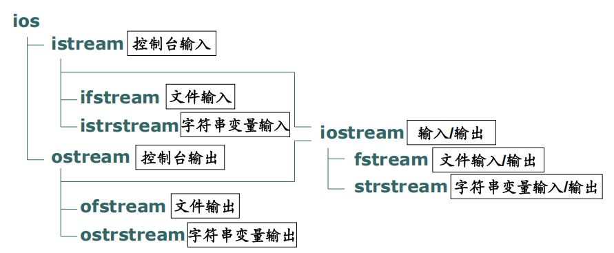

# 第9章 C++ 输入/输出（I/O）复习笔记

## 9.1 输入/输出概述
### 9.1.1 核心概念
- **输入**：从外设（键盘、文件等）获取程序运行所需的数据
- **输出**：将程序运行结果输出到外设（显示器、打印机、文件等）
- C++ 的 I/O 功能属于 **C++ 标准库** 的一部分：
  - 原生支持所有基本数据类型的 I/O 操作
  - 自定义类可通过重载 I/O 操作符实现自定义输入输出

### 9.1.2 字节流机制
C++ 的 I/O 操作基于**字节流**模型：
- 输入：数据以字节为单位，从外设逐个流入内存
- 输出：数据以字节为单位，从内存逐个流出外设

### 9.1.3 I/O 的分类
1. **按数据来源/去向划分**
   - 面向控制台的 I/O
   - 面向文件的 I/O
   - 面向字符串变量的 I/O

2. **按设计范式划分**
   - **过程式**：沿用 C 语言的标准 I/O 函数库
   - **面向对象**：通过 C++ 自带的 I/O 类库实现

### 9.1.4 I/O 类库的类层次结构


### 9.1.5 核心类的基本使用
#### istream（输入流基类）
1. 创建 `istream` 或其派生类的对象
2. 重载**抽取操作符 `>>`**，实现基本类型数据的输入
```cpp
istream in(...);
in >> x;      // 输入单个变量
in >> x >> y; // 连续输入多个变量
```

#### ostream（输出流基类）
1. 创建 `ostream` 或其派生类的对象
2. 重载**插入操作符 `<<`**，实现基本类型数据的输出
```cpp
ostream out(...);
out << e1;      // 输出单个表达式
out << e1 << e2;// 连续输出多个表达式
```

## 9.2 面向控制台的输入/输出
### 9.2.1 基于函数库（C 风格）的控制台 I/O
头文件：`#include <cstdio>`（或 `#include <stdio.h>`）

#### 输出函数
| 函数原型 | 功能说明 | 返回值 |
|---------|---------|-------|
| `int putchar(int ch);` | 输出单个字符 `ch` | 成功返回输出的字符，失败返回 `EOF`（值为 -1） |
| `int puts(const char *p);` | 输出 `p` 指向的字符串 | 成功返回非负整数（通常为 0），失败返回 `EOF` |
| `int printf(const char *format, <参数表>);` | 按格式输出基本类型数据 | 成功返回输出的字符个数，失败返回负数 |

#### 输入函数
| 函数原型 | 功能说明 | 返回值 |
|---------|---------|-------|
| `int getchar();` | 从键盘输入一个字符 | 成功返回输入的字符，失败返回 `EOF` |
| `char *gets(char *p);` | 从键盘输入字符串，存入 `p` 指向的内存 | 成功返回指针 `p`，失败返回 `NULL` |
| `int scanf(const char *format, <参数表>);` | 按格式输入基本类型数据 | 成功返回读入的数据个数，失败返回 `EOF` |

### 9.2.2 基于类库（C++ 风格）的控制台 I/O
头文件：`#include <iostream>`，通常配合 `using namespace std;` 使用

#### 预定义 I/O 对象
| 对象 | 所属类 | 对应设备与用途 |
|------|--------|--------------|
| `cin` | `istream` | 标准输入设备（键盘） |
| `cout` | `ostream` | 标准输出设备（显示器），输出程序正常结果 |
| `cerr` | `ostream` | 标准错误输出，无缓冲，用于输出错误信息 |
| `clog` | `ostream` | 标准错误输出，有缓冲，用于输出错误信息 |

#### 输出操作：插入操作符 `<<`
支持所有基本类型、字符串、指针的连续输出。
> 特殊说明：`const char*` 类型指针默认输出字符串内容；若要输出指针地址，需强制转为 `void*`
> ```cpp
> const char *q = "abcd";
> cout << q;        // 输出字符串 "abcd"
> cout << (void *)q;// 输出指针 q 的地址值
> ```

##### 常用输出操纵符
> 注意：`setprecision`、`setiosflags` 等操纵符需要引入头文件 `#include <iomanip>`🥦

| 操纵符 | 功能说明 |
|--------|---------|
| `endl` | 输出换行符，并执行 `flush` 刷新输出缓冲区 |
| `flush` | 立即将缓冲区内容输出到设备 |
| `dec` | 整数按十进制输出 |
| `oct` | 整数按八进制输出 |
| `hex` | 整数按十六进制输出 |
| `setprecision(int n)` | 浮点数精度控制：<br>1. `scientific`/`fixed` 格式下：设置小数点后位数<br>2. 默认自动格式下：设置有效数字总个数 |
| `setiosflags(long flags)` | 设置输出格式标志，常用：<br>- `ios::scientific`：浮点数按科学计数法显示<br>- `ios::fixed`：浮点数按固定小数位显示 |
| `resetiosflags(long flags)` | 取消指定的输出格式标志 |

##### ostream 字节流成员函数
除 `<<` 操作符外，可直接按字节输出：
- `ostream& ostream::put(char ch);`：输出单个字节（字符）
- `ostream& ostream::write(const char *p, int count);`：输出 `p` 指向内存中连续 `count` 个字节

#### 输入操作：抽取操作符 `>>`
- 支持所有基本类型数据的输入
- 多个输入数据之间用**空白符**（空格、制表符、换行）分隔
- 可配合操纵符控制输入格式，例如 `setw(n)` 限制字符串输入长度
```cpp
int x; double y; char str[10];
cin >> x >> y;
cin >> setw(10) >> str; // 最多读入 9 个字符，自动补 '\0'
```

##### istream 字节流成员函数
- `istream::get(char &ch);`：输入单个字节（字符）
- `istream::getline(char *p, int count, char delim='\n');`：读入字符串，直到读满 `count-1` 个字符或遇到分隔符 `delim`，自动补 `\0`
- `istream::read(char *p, int count);`：读入 `count` 个字节到 `p` 指向的内存

### 9.2.3 抽取/插入操作符的重载⭐
自定义类要支持 `<<` 和 `>>`，需以**友元全局函数**的形式重载操作符。

#### 基础重载语法
```cpp
class A {
    int x, y;
public:
    // 声明为友元函数
    friend ostream& operator << (ostream& out, const A &a);
};

// 全局函数实现
ostream& operator << (ostream& out, const A &a) {
    out << a.x << ',' << a.y;
    return out; // 返回流对象，支持连续调用
}

// 使用示例
A a;
cout << a << endl;
```

#### 派生类中的再次重载
```cpp
class B: public A {
    int z;
public:
    friend ostream& operator << (ostream& out, const B &b);
};

ostream& operator << (ostream& out, const B &b) {
    out << (A&)b << ',' << b.z; // 先调用父类的重载版本
    return out;
}
```

#### 动态绑定问题与解决方案
直接重载 `operator<<` **无法实现多态**：父类指针指向子类对象时，只会调用父类的重载版本。

**解决方案**：在类中定义虚函数完成输出逻辑，`operator<<` 调用该虚函数实现动态绑定。
```cpp
class A {
    int x,y;
public:
    virtual void display(ostream& out) const {
        out << x << ',' << y ;
    }
};

// 全局 operator<< 调用虚函数
ostream& operator << (ostream& out, const A& a) {
    a.display(out); // 运行时动态绑定
    return out;
}

class B: public A {
    double z;
public:
    void display(ostream& out) const { // 重写虚函数
        A::display(out);
        out << ',' << z;
    }
};
```


## 9.3 面向文件的输入/输出
### 9.3.1 文件基本概念
- **流式文件**：C++ 将文件视为连续的字节序列，按字节逐个操作
- 标准操作流程：**打开文件 → 读写文件 → 关闭文件**
- **位置指针**：每个打开的文件都有隐式的读写位置指针，每次读写后自动后移

#### 文件的两种存储方式
1. **文本方式（text）**
   - 存储可显示字符和少量控制字符（`\n`、`\t` 等），具有“行”结构
   - 示例：整数 `1234567` 存储为 7 个字节（每个数字的 ASCII 码）

2. **二进制方式（binary）**
   - 存储数据的原始二进制内容，无显式结构
   - 示例：整数 `1234567` 存储为 4 个字节（int 类型的内存补码）

### 9.3.2 基于函数库（C 风格）的文件 I/O
头文件：`#include <cstdio>`（或 `#include <stdio.h>`）

#### 文件基础操作
| 函数原型 | 功能说明 | 返回值 |
|---------|---------|-------|
| `FILE *fopen(const char *filename, const char *mode);` | 打开文件 | 成功返回 `FILE*` 指针，失败返回 `NULL` |
| `int fclose(FILE *stream);` | 关闭文件 | 成功返回 0，失败返回非 0 |
| `int fseek(FILE *stream, long offset, int origin);` | 移动位置指针：从 `origin` 偏移 `offset` 字节 | 成功返回 0，失败返回非 0 |
| `long ftell(FILE *stream);` | 获取位置指针的当前位置 | 返回当前字节偏移量 |
| `int feof(FILE *stream);` | 判断是否到达文件末尾 | 到达末尾返回非 0，否则返回 0 |

#### 文件输出函数
| 函数原型 | 功能说明 |
|---------|---------|
| `int fputc(int c, FILE *stream);` | 向文件输出单个字符 |
| `int fputs(const char *string, FILE *stream);` | 向文件输出字符串 |
| `int fprintf(FILE *stream, const char *format, <参数表>);` | 按格式向文件输出数据 |
| `size_t fwrite(const void *buffer, size_t size, size_t count, FILE *stream);` | 按字节块输出：`size` 为单块字节数，`count` 为块数 |

#### 文件输入函数
| 函数原型 | 功能说明 |
|---------|---------|
| `int fgetc(FILE *stream);` | 从文件读入单个字符 |
| `char* fgets(char *string, int n, FILE *stream);` | 从文件读入字符串 |
| `int fscanf(FILE *stream, const char *format, <参数表>);` | 按格式从文件读入数据 |
| `size_t fread(void *buffer, size_t size, size_t count, FILE *stream);` | 按字节块读入数据 |

### 9.3.3 基于类库（C++ 风格）的文件 I/O
头文件：`#include <fstream>`

#### 文件输出类：ofstream
##### 1. 打开与关闭文件
两种打开方式：
```cpp
// 方式1：构造函数直接绑定文件
ofstream out_file("文件名", 打开方式);

// 方式2：先创建对象，再调用 open 成员函数
ofstream out_file;
out_file.open("文件名", 打开方式);
```

判断打开失败：
```cpp
if (!out_file) { /* 打开失败处理 */ }
// 等价写法：out_file.fail() 或 !out_file.is_open()
```

关闭文件：
```cpp
out_file.close();
```

##### 2. 常用打开方式
| 打开方式 | 说明 | 对应 C 语言模式 |
|---------|------|--------------|
| `ios::out` | 文件存在则清空内容，不存在则创建；指针指向文件开头 | `w` |
| `ios::app` | 文件不存在则创建；指针指向文件末尾，追加写入 | `a` |
| `ios::out \| ios::binary` | 二进制方式打开，用于写入 | `wb` |
| `ios::app \| ios::binary` | 二进制方式打开，用于追加 | `ab` |

> 默认打开方式为**文本方式**

##### 3. 输出流位置指针操作
- `ostream& ostream::seekp(位置);`：设置绝对位置
- `ostream& ostream::seekp(偏移量, 参照位置);`：设置相对位置
  - 参照位置：`ios::beg`（文件头）、`ios::cur`（当前位置）、`ios::end`（文件尾）
- `streampos ostream::tellp();`：获取当前指针位置

##### 4. 输出操作示例
- 文本方式输出（`<<` 操作符）
  ```cpp
  ofstream out_file("d:\\myfile.txt", ios::out);
  out_file << x << ' ' << y << endl;
  ```
- 二进制方式输出（`write` 成员函数）
  ```cpp
  ofstream out_file("d:\\myfile.dat", ios::out | ios::binary);
  out_file.write((char *)&x, sizeof(x));
  ```

#### 文件输入类：ifstream
##### 1. 打开与关闭文件
```cpp
// 构造函数直接打开
ifstream in_file("文件名", 打开方式);

// 先创建对象后打开
ifstream in_file;
in_file.open("文件名", 打开方式);
```
打开失败判断与关闭方式与 `ofstream` 一致。

##### 2. 常用打开方式
| 打开方式 | 说明 | 对应 C 语言模式 |
|---------|------|--------------|
| `ios::in` | 打开文件用于读取；文件不存在则打开失败；指针指向文件开头 | `r` |
| `ios::in \| ios::binary` | 二进制方式打开，用于读取 | `rb` |

##### 3. 输入流位置指针操作
- `istream& istream::seekg(位置);`：设置绝对位置
- `istream& istream::seekg(偏移量, 参照位置);`：设置相对位置
- `streampos istream::tellg();`：获取当前指针位置
- `int ios::eof();`：判断是否到达文件末尾，返回非 0 表示已到末尾

##### 4. 输入操作示例
- 文本方式输入（`>>` 操作符）
  ```cpp
  ifstream in_file("d:\\myfile.txt", ios::in);
  in_file >> x >> y;
  ```
- 二进制方式输入（`read` 成员函数）
  ```cpp
  ifstream in_file("d:\\myfile.dat", ios::in | ios::binary);
  in_file.read((char *)&x, sizeof(x));
  ```

#### 读写文件类：fstream
用于同时支持文件的读和写，创建 `fstream` 对象，打开方式需组合标志：
- `ios::in | ios::out`：可在文件任意位置读写
- `ios::in | ios::app`：可在任意位置读，只能在文件末尾追加写入

## 9.4 面向字符串变量的输入/输出
### 9.4.1 用途
将内存中的字符串变量作为 I/O 的数据源/目的地，不直接操作外设或文件，常用于数据格式转换、字符串拼接、内存数据格式化等场景。

### 9.4.2 旧式字符串流：strstream 系列
头文件：`#include <strstream>`

#### 输出字符串流 ostrstream
将格式化数据输出到字符数组：
```cpp
char buf[100];
ostrstream str_buf(buf);  // 将流对象与字符数组绑定
str_buf << x << y << endl;// 向字符串流写入数据
```

#### 输入字符串流 istrstream
从字符数组中读取格式化数据：
```cpp
char buf[100] = "123 45.6";
istrstream str_buf(buf); // 将流对象与字符数组绑定
str_buf >> x >> y;       // 从字符串流读取数据
```

### 9.4.3 新式字符串流：sstream 系列
C++ 新标准中，`strstream` 系列被更安全的字符串流替代，对应关系：
- `istrstream` → `istringstream`
- `ostrstream` → `ostringstream`
- `strstream` → `stringstream`

头文件：`#include <sstream>`
