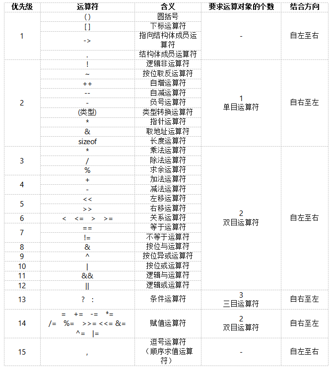

# 速查笔记

## 一、常用ASCII码

|字符|ASCII|字符|ASCII|
|---|---|---|---|
|空格|32|A|65|
|0|48|a|97|


## 二、格式控制符对照表

| 格式控制符 | 适用数据类型 | 功能说明 |
| --- | ---- | ---- |
| `%d` | int | 输出/输入十进制有符号整数 |
| `%u` | unsigned int | 输出/输入十进制无符号整数 |
| `%o` | unsigned int | 输出/输入八进制无符号整数 |
| `%x`/`%X` | unsigned int | 输出/输入十六进制无符号整数（小写/大写字母） |
| `%c` | char | 输出/输入单个字符 |
| `%s` | char[] / char* | 输出/输入字符串 |
| `%f` | float / double | 输出/输入十进制浮点数（默认保留6位小数） |
| `%e`/`%E` | float / double | 以科学计数法输出/输入浮点数（小写/大写e） |
| `%g`/`%G` | float / double | 自动选择`%f`或`%e`中更简洁的格式 |
| `%p` | 指针类型 | 输出指针的内存地址 |
| `%%` | - | 输出一个百分号`%` |

## 三、转义字符

| 转义字符 | 含义说明 | 常见用途 |
| --- | --- | --- |
| `\n` | 换行符，将光标移到下一行开头 | 输出换行，分割不同内容 |
| `\t` | 水平制表符，相当于按Tab键 | 格式化输出，对齐数据（通常占8列） |
| `\\` | 表示反斜杠字符 `\` 本身 | 输出反斜杠，如文件路径、正则表达式 |
| `\"` | 表示双引号字符 `"` 本身 | 在字符串中嵌入双引号 |
| `\'` | 表示单引号字符 `'` 本身 | 在字符常量中嵌入单引号（如 `char c = '\'';`） |
| `\r` | 回车符，将光标移到当前行开头 | 不换行重置光标位置，如进度条刷新 |
| `\b` | 退格符，光标向前移动一位 | 删除光标前一个字符 |
| `\f` | 换页符，切换到新的一页 | 文档打印时常用，终端中较少见 |
| `\a` | 响铃符，触发系统提示音 | 发出警告或提示声（终端支持才有效） |

## 四、运算优先级
1. 初等运算符（ ( ) [ ] -> . ）
2. 单目运算符
3. 算术运算符（先乘除后加减）
4. 关系运算符
5. 逻辑运算符（不包括!）
6. 条件运算符
7. 赋值运算符 
8. 逗号运算符


## 五、基本数据类型字节数及取值范围

1 字节= $2^3$ 比特
### 1.基本数据类型字节数

#### a. 整型类型
你想了解的是C语言中各种整型类型的取值范围，这是C语言基础中非常重要的知识点，掌握它能帮你避免编程时出现数值溢出的问题。

### 一、C语言整型类型的分类与范围
C语言的整型主要分为**有符号**（signed）和**无符号**（unsigned）两大类，不同类型占用的字节数和取值范围不同。以下是最常用的整型类型及其标准范围（基于常见的32/64位系统）：

| 类型               | 字节 | 有符号范围| 无符号范围|
|--------------------|----------|---------------------------------------|---------------------------|
| char               | 1        | -128 ~ 127                            | 0 ~ 255                   |
| short       | 2        | -32768 ~ 32767                        | 0 ~ 65535                 |
| int                | 4        | -2147483648 ~ 2147483647              | 0 ~ 4294967295            |
| long         | 4/8      | $-2^{31}$ ~ $ 2-^{31}-1$<br>/ $-2^{63}$ ~ $2^{63}-1$ | 0 ~ $2^{32}-1$<br>/ 0 ~ $2^{64}-1$ |
| long long    | 8        | $-2^{63}$ ~ $2^{63}-1$ | 0 ~ $2^{64}-1$  |

#### b. 浮点型类型

| 数据类型 | 字节数（32/64位系统） | 有效数字位数 | 取值范围（约） |
| --- | --- | --- | --- |
| `float` | 4 | 6~7位 | ±3.4×10^-38 ~ ±3.4×10^38 |
| `double` | 8 | 15~16位 | ±1.7×10^-308 ~ ±1.7×10^308 |
| `long double` | 8/16 | 15~19位 | 随编译器变化（通常≥`double`） |

#### c. 其他常用类型

| 数据类型 | 字节数（64位系统） | 字节数（32位系统） | 说明 |
| --- | --- | --- | --- |
| `void*` | 8 | 4 | 通用指针类型（存储内存地址） |
| `size_t` | 8 | 4 | 无符号整型（通常等于`unsigned long`） |

### 2. 整型类型的取值范围

整型取值范围由**字节数**和**是否有符号**决定：

- 有符号整型：采用补码存储，最高位为符号位（0=正，1=负），取值范围为 `[-2^(n-1), 2^(n-1)-1]`（n为总位数，1字节=8位）
- 无符号整型：无符号位，所有位均表示数值，取值范围为 `[0, 2^n - 1]`

### 具体整型取值范围（通用情况）

| 数据类型 | 位数 | 取值范围|
| --- | --- | --- |
| `char` | 8 | [-128, 127] |
| `unsigned char` | 8 | [0, 255] |
| `short` | 16 | [-32768, 32767] |
| `unsigned short` | 16 | [0, 65535] |
| `int` | 32 | [-2147483648, 2147483647]（约±21亿） |
| `unsigned int` | 32 | [0, 4294967295]（约42亿） |
| `long`（64位） | 64 | [-9223372036854775808, 9223372036854775807]（约±9e18） |
| `long`（32位） | 32 | 与`int`一致：[-2147483648, 2147483647] |
| `unsigned long`（64位） | 64 | [0, 18446744073709551615]（约1.8e19） |
| `long long` | 64 | 与64位`long`一致：[-9e18, 9e18] |
| `unsigned long long` | 64 | [0, 1.8e19] |
## 六、math.h
`math.h` 是 C 语言中用于数学计算的标准头文件，包含了大量常用的数学函数。下面我会按功能分类，为你介绍最常用的函数，并附上示例代码，方便你理解和使用。

### 1.基础算术函数
| 函数原型 | 功能说明 | 示例 |
|----------|----------|------|
| `double fabs(double x)` | 计算绝对值（适用于浮点数，整数用 `abs()`） | `fabs(-3.14)` → `3.14` |
| `double fmod(double x, double y)` | 计算 x 除以 y 的余数（浮点数取模） | `fmod(5.5, 2.0)` → `1.5` |
| `double pow(double x, double y)` | 计算 x 的 y 次方（x^y） | `pow(2, 3)` → `8.0` |
| `double sqrt(double x)` | 计算平方根（x≥0） | `sqrt(16)` → `4.0` |
| `double cbrt(double x)` | 计算立方根（支持负数） | `cbrt(-8)` → `-2.0` |

### 2.指数与对数函数
| 函数原型 | 功能说明 | 示例 |
|----------|----------|------|
| `double exp(double x)` | 计算自然指数 e^x（e≈2.71828） | `exp(1.0)` → `2.71828...` |
| `double log(double x)` | 计算自然对数 ln(x)（x>0） | `log(exp(1))` → `1.0` |
| `double log10(double x)` | 计算以 10 为底的对数 lg(x)（x>0） | `log10(100)` → `2.0` |

### 3.三角函数（参数为弧度）
| 函数原型 | 功能说明 | 示例 |
|----------|----------|------|
| `double sin(double x)` | 正弦函数 | `sin(M_PI/2)` → `1.0`（M_PI 是 π，需定义 `_USE_MATH_DEFINES`） |
| `double cos(double x)` | 余弦函数 | `cos(M_PI)` → `-1.0` |
| `double tan(double x)` | 正切函数 | `tan(M_PI/4)` → `1.0` |
| `double asin(double x)` | 反正弦（返回值范围 [-π/2, π/2]，x∈[-1,1]） | `asin(1.0)` → `π/2` |
| `double acos(double x)` | 反余弦（返回值范围 [0, π]，x∈[-1,1]） | `acos(-1.0)` → `π` |
| `double atan(double x)` | 反正切（返回值范围 [-π/2, π/2]） | `atan(1.0)` → `π/4` |

### 4.取整函数
| 函数原型 | 功能说明 | 示例 |
|----------|----------|------|
| `double floor(double x)` | 向下取整（取不大于 x 的最大整数） | `floor(3.9)` → `3.0`，`floor(-3.1)` → `-4.0` |
| `double ceil(double x)` | 向上取整（取不小于 x 的最小整数） | `ceil(3.1)` → `4.0`，`ceil(-3.9)` → `-3.0` |
| `double round(double x)` | 四舍五入取整 | `round(3.4)` → `3.0`，`round(3.5)` → `4.0` |

## 七、板子题
#### 1. 辗转相除法
```C
int gcd(int a, int b) {
    while (b != 0) {
        int temp = a % b; 
        a = b;                
        b = temp;         
    }
    return a;
}
```
#### 2. 冒泡排序
```C
void bubbleSort(int arr[], int n) {
    for (int i = 0; i < n - 1; i++) {
        int swapped = 0;
        for (int j = 0; j < n - 1 - i; j++) {
            if (arr[j] > arr[j + 1]) {
                int temp = arr[j];
                arr[j] = arr[j + 1];
                arr[j + 1] = temp;
                swapped = 1; 
            }
        }
        if (swapped == 0) {
            break;
        }
    }
}
```