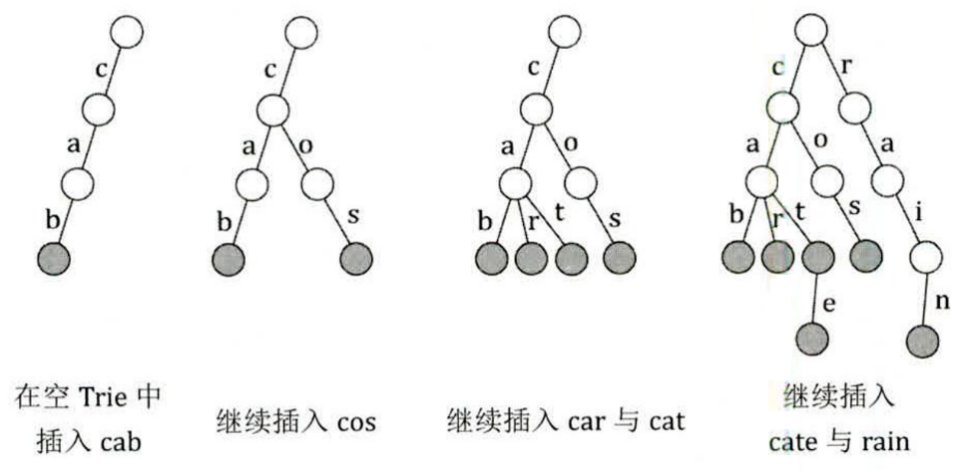

# 字典树（Trie 树）学习笔记
## 一、核心概念与定义
### 1. 基本定义
字典树（Trie 树）是一种**多叉树结构**，专门用于高效存储和检索字符串（或二进制）集合，核心优势是利用**字符串的公共前缀**减少存储冗余，提高查询效率。


### 2. 核心特点
- 节点存储：每个节点代表一个字符（或二进制位），不直接存储完整字符串，仅记录路径上的字符组合。
- 路径含义：从根节点到某一节点的路径，对应一个完整字符串或字符串前缀。
- 终止标记：部分节点带有终止标记（如 `end[p]`），表示该节点是某一字符串的结尾。
- 效率优势：插入和查询操作的时间复杂度均为 $O(L)$（$L$ 为字符串长度），与集合中字符串总数无关。

### 3. 适用场景
- 字符串前缀匹配（如自动补全、前缀统计）。
- 字符串快速查找（如词典查询、去重）。
- 二进制信息处理（如最大异或对、最长异或路径）。

## 二、基础结构与代码实现（字符串Trie）
假设处理由小写字母构成的字符串，核心结构包括：存储子节点指针的二维数组、终止标记数组、节点计数器。

### 1. 核心变量定义
```cpp
const int N = 1e5 + 10;  // 节点总数上限（根据题目调整）
const int C = 26;        // 字符集大小（小写字母共26个）
int trie[N][C];          // trie[p][ch]：节点p的第ch个字符（0-25对应a-z）的子节点编号
bool end[N];             // end[p]：标记节点p是否为某字符串的结尾
int tot = 1;             // 节点编号计数器，根节点固定为1
char str[N];             // 存储待插入/查询的字符串
```

### 2. 插入操作（insert）
将字符串插入Trie树，核心是按字符顺序创建节点路径，标记字符串结尾。
```cpp
inline void insert() {
    int len = strlen(str + 1);  // 假设字符串从下标1开始存储
    int p = 1;                  // 从根节点（1号节点）出发
    for (int i = 1; i <= len; ++i) {
        int ch = str[i] - 'a';  // 将字符转为0-25的索引
        if (!trie[p][ch])       // 若当前节点无该字符的子节点，创建新节点
            trie[p][ch] = ++tot;
        p = trie[p][ch];        // 移动到子节点
    }
    end[p] = true;              // 标记当前节点为字符串结尾
}
```

### 3. 查找操作（search）
查询字符串是否存在于Trie树中，核心是按字符顺序遍历路径，判断是否走到有效结尾。
```cpp
inline bool search() {
    int len = strlen(str + 1);
    int p = 1;
    for (int i = 1; i <= len; ++i) {
        int ch = str[i] - 'a';
        if (!trie[p][ch])       // 路径断裂，字符串不存在
            return false;
        p = trie[p][ch];
    }
    return end[p];              // 确认当前节点是否为字符串结尾
}
```

## 三、典型应用场景与例题
### 1. 应用1：前缀统计（统计以某字符串为前缀的单词个数）
#### 问题描述
给定若干单词和若干查询前缀，对每个前缀，统计有多少个单词以其为前缀。

#### 核心修改
- 在节点中增加计数数组 `count_end[p]`，记录以该节点为结尾的单词个数（或经过该节点的前缀对应的单词总数）。

#### 代码实现
```cpp
int count_end[N];  // 新增：count_end[p]表示以节点p为结尾的单词个数

// 插入函数修改
inline void insert(char *s) {
    int len = strlen(s + 1);
    int p = 1;
    for (int i = 1; i <= len; ++i) {
        int ch = s[i] - 'a';
        if (!trie[p][ch])
            trie[p][ch] = ++tot;
        p = trie[p][ch];
    }
    count_end[p]++;  // 该单词结尾节点计数+1
}

// 统计前缀函数
inline int get_ans(char *t) {
    int len = strlen(t + 1);
    int p = 1, ans = 0;
    for (int i = 1; i <= len; ++i) {
        p = trie[p][t[i] - 'a'];
        if (!p) break;  // 前缀不存在，直接返回0
        ans += count_end[p];  // 累加经过节点的单词个数
    }
    return ans;
}
```

### 2. 应用2：01 Trie（二进制处理——最大异或对）
#### 问题描述
给定一个整数数组，找到数组中两个数的异或结果的最大值。

#### 核心思路
- 异或性质：两个二进制数的异或值最大，需尽量让每一位（**从高位到低位**`（贪心）`）都为1（即对应位不同）。
- 01 Trie结构：每个节点存储二进制位（0或1），将每个整数的二进制表示（32位或64位）插入Trie树。
- 查询逻辑：对每个数，在Trie树中查找能与其异或出最大值的数（优先选择与当前位相反的二进制位）。

#### 代码实现
```cpp
const int N = 1e5 + 10;
const int BIT = 31;  // 32位整数，最高位为符号位，取0-31位
int ch[N * 32][2];  // 01 Trie节点，ch[p][0/1]表示节点p的0/1子节点
int tot = 1;

// 插入整数x的二进制表示（从高位到低位）
inline void insert(int x) {
    int p = 1;
    for (int i = BIT; i >= 0; --i) {  // 从最高位（31位）到最低位（0位）
        int bit = (x >> i) & 1;       // 提取第i位的二进制值（0或1）
        if (!ch[p][bit])
            ch[p][bit] = ++tot;
        p = ch[p][bit];
    }
}

// 查询x与Trie树中数的最大异或值
inline int query(int x) {
    int p = 1, max_xor = 0;
    for (int i = BIT; i >= 0; --i) {
        int bit = (x >> i) & 1;
        int target_bit = 1 - bit;     // 优先选择相反位，最大化异或值
        if (ch[p][target_bit]) {      // 存在相反位，选择该路径
            max_xor += (1 << i);      // 第i位异或为1，累加结果
            p = ch[p][target_bit];
        } else {                      // 无相反位，选择相同位
            p = ch[p][bit];
        }
    }
    return max_xor;
}

// 主函数求解最大异或对
int main() {
    int n, ans = 0;
    cin >> n;
    for (int i = 0; i < n; ++i) {
        int x;
        cin >> x;
        insert(x);
        ans = max(ans, query(x));  // 插入后查询，避免与自身异或
    }
    cout << ans << endl;
    return 0;
}
```

### 3. *应用3：最长异或路径（树结构上的01 Trie）
#### 问题描述
给定一棵带权树，找到树上任意两点之间路径的异或值的最大值（路径异或值为路径上所有边权的异或和）。

#### 核心思路
- 路径异或性质：两点u、v之间的路径异或和 = 根到u的异或和 ^ 根到v的异或和（记为 `dis[u] ^ dis[v]`）。
- 转化问题：先通过DFS计算所有节点到根的异或和 `dis[]`，问题转化为在 `dis[]` 数组中找一对数的最大异或值（同“最大异或对”问题）。

#### 关键代码
```cpp
// 树的邻接表存储
struct Edge {
    int to, w, nxt;
} edge[N * 2];  // 无向树，边数为2*(n-1)
int head[N], cnt_edge = 0;
int dis[N], vis[N];  // dis[x]：根到x的异或和；vis[x]：DFS访问标记

// 邻接表加边
inline void add_edge(int u, int v, int w) {
    edge[++cnt_edge] = {v, w, head[u]};
    head[u] = cnt_edge;
    edge[++cnt_edge] = {u, w, head[v]};
    head[v] = cnt_edge;
}

// DFS计算dis数组
inline void dfs(int x) {
    vis[x] = 1;
    for (int i = head[x]; i; i = edge[i].nxt) {
        int to = edge[i].to;
        if (vis[to]) continue;  // 避免回退到父节点
        dis[to] = dis[x] ^ edge[i].w;
        dfs(to);
    }
}

// 主逻辑
int main() {
    int n;
    cin >> n;
    for (int i = 1; i < n; ++i) {
        int u, v, w;
        cin >> u >> v >> w;
        add_edge(u, v, w);
    }
    dfs(1);  // 以1为根节点计算dis数组
    // 后续同最大异或对：插入所有dis[i]到01 Trie，查询最大值
    int ans = 0;
    insert(dis[1]);
    for (int i = 2; i <= n; ++i) {
        ans = max(ans, query(dis[i]));
        insert(dis[i]);
    }
    cout << ans << endl;
    return 0;
}
```

### 4. 应用4：阅读理解（多文档关键词匹配）
#### 问题描述
给定n篇文章和m个查询关键词，对每个关键词，输出包含该关键词的文章编号。

#### 核心思路
- 节点存储：每个节点增加二维数组 `exist[u][num]`，标记该节点对应的字符串是否是第num篇文章的关键词。
- 插入逻辑：按文章编号插入关键词，标记对应的文章编号。
- 查询逻辑：遍历关键词路径，若路径存在，输出所有标记的文章编号。

#### 代码实现
```cpp
const int N = 1e5 + 10;
const int C = 26;
int ch[N][C], tot = 1;
bool exist[N][110];  // exist[u][num]：第num篇文章包含节点u对应的关键词（num<=100）
int n, m;

// 插入关键词s到第num篇文章
inline void insert(char *s, int num) {
    int len = strlen(s);
    int u = 1;
    for (int i = 0; i < len; ++i) {
        int c = s[i] - 'a';
        if (!ch[u][c])
            ch[u][c] = ++tot;
        u = ch[u][c];
    }
    exist[u][num] = true;  // 标记该关键词属于第num篇文章
}

// 查询关键词s，输出包含它的文章编号
inline void find(char *s) {
    int len = strlen(s);
    int u = 1;
    bool flag = 0;
    for (int i = 0; i < len; ++i) {
        int c = s[i] - 'a';
        if (!ch[u][c]) {
            flag = 1;  // 关键词不存在
            break;
        }
        u = ch[u][c];
    }
    if (flag) {
        printf("\n");
        return;
    }
    // 输出所有包含该关键词的文章编号
    for (int i = 1; i <= n; ++i) {
        if (exist[u][i])
            printf("%d ", i);
    }
    printf("\n");
}
```

## 四、关键总结
### 1. 核心优势与局限
- 优势：前缀共享、插入/查询效率高（$O(L)$）、适合批量字符串处理。
- 局限：空间消耗较大（节点数=所有字符串长度之和×字符集大小），适合字符集较小的场景（如小写字母、二进制）。

### 2. 优化技巧
- 空间优化：使用动态数组（如vector）替代固定大小的二维数组，减少冗余空间。
- 字符集扩展：若处理大小写字母、数字等，需调整 `C` 的大小和字符转索引的逻辑（如 `ch = s[i] - '0'` 处理数字）。
- 多模式匹配：结合AC自动机，解决多个关键词同时匹配的问题（如敏感词过滤）。

### 3. 常见误区
- 节点编号从1开始：避免与0（空指针）冲突，简化逻辑。
- 二进制处理需从高位到低位：确保异或等操作优先最大化高位，保证结果最优。
- 终止标记不可省略：否则无法区分“前缀”和“完整字符串”（如查询“car”时，避免误判“card”为匹配）。

### 4. 对比其他数据结构
| 数据结构       | 插入时间 | 查询时间 | 核心优势                  | 适用场景                  |
|----------------|----------|----------|---------------------------|---------------------------|
| Trie树         | $O(L)$   | $O(L)$   | 前缀匹配、共享存储        | 字符串批量处理、前缀统计  |
| 哈希表         | $O(L)$   | $O(L)$   | 单点查询快                | 单个字符串查找、去重      |
| 平衡二叉搜索树 | $O(L\log n)$ | $O(L\log n)$ | 有序存储、范围查询        | 有序字符串集合、排序需求  |

综上，Trie树是字符串前缀相关问题的最优解，二进制场景下的01 Trie更是解决异或类问题的核心工具。