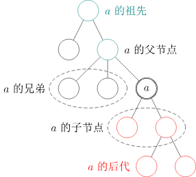
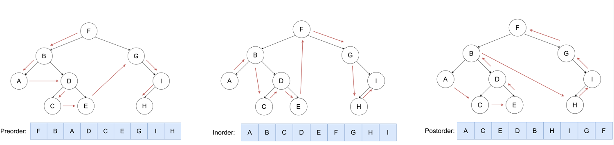

# 树上问题详细笔记
## 一、基础概念
### （一）树的核心定义
1. **无根树（unrooted tree）**：无固定根结点的树，有以下等价定义：
    - 含n个结点、n-1条边的连通无向图；
    - 无向无环的连通图；
    - 任意两个结点之间有且仅有一条简单路径的无向图；
    - 任何边均为桥（删除该边会使图不连通）的连通图；
    - 没有圈，且在任意不同两点间添加一条边后所得图含唯一圈的图。
2. **有根树（rooted tree）**：在无根树基础上指定一个结点作为根，虽仍以无向图表示，但明确了结点间的**上下级关系**。

### （二）通用概念（适用于无根树和有根树）
1. **森林（forest）**：每个连通分量（连通块）都是树的图，一棵树本身也是森林。
2. **生成树（spanning tree）**：连通无向图的生成子图（包含原图所有顶点），且是树（即选取n-1条边将所有顶点连通）。
3. **叶结点（leaf node）**：
    - 无根树：度数不超过1的结点（注：只有一个结点，即n=1时，该结点度数为0，仍属于叶结点，故不定义为“度数恰为1”）；
    - 有根树：没有子结点的结点。（根不算）

### （三）有根树专属概念
1. **父亲（parent node）**：除根以外的每个结点，其父亲是该结点到根路径上的第二个结点；根结点无父结点。
2. **祖先（ancestor）**：一个结点到根结点的路径上，除该结点本身外的所有结点；根结点的祖先集合为空。
3. **子结点（child node）**：若v是u的父亲，则u是v的子结点；子结点顺序一般不区分，二叉树为例外。
4. 结点的**深度（depth）**：结点到根结点的路径上的边数（根的深度定义为0或1.
5. 树的**高度（height）**：树中所有结点深度的最大值。
6. **兄弟（sibling）**：同一个父亲的多个子结点互为兄弟。
7. **后代（descendant）**：子结点及子结点的后代；也可理解为：若u是v的祖先，则v是u的后代。
8. **子树（subtree）**：删掉结点与父亲相连的边后，该结点所在的子图（例如结点a的子树，即删除a与其父结点的边后，a及其所有后代构成的子图）。

## 二、特殊的树
### （一）链（chain/path graph）
满足“任一结点相连的边不超过2条”的树，形态呈线性。

### （二）菊花/星星（star）
存在一个结点u，使得所有除u以外的结点均与u直接相连的树，u为中心结点。

### （三）有根二叉树（rooted binary tree）
每个结点最多只有两个子结点的有根树，通常区分两个子结点的顺序，称为左子结点和右子结点；多数情况下，“二叉树”均特指有根二叉树。

### （四）完整二叉树（full/proper binary tree）
每个结点的子结点数量为0或2的二叉树，即每个结点要么是叶结点，要么左右子树均非空。

### （五）完全二叉树（complete binary tree）
只有最下面两层结点的度数可以小于2，且最下面一层的结点都集中在该层最左边的连续位置上。

### （六）完美二叉树（perfect binary tree）
所有叶结点的深度均相同，且所有非叶结点的子结点数量均为2的二叉树。

>- 基环树
如果一张无向连通图包含恰好一个环，则称它是一棵基环树
n 个点 n 条边
>- 基环森林
多棵基环树可以组成基环森林
>- 仙人掌 
如果一张无向连通图的每条边最多在一个环内，则称它是一棵仙人掌
>- 沙漠
多棵仙人掌可以组成沙漠
## 三、树的存储方式
### （一）父亲数组存储
用数组`parent[N]`记录每个结点的父亲结点（适用于一般有根树）。

### （二）二叉树专用存储
需记录每个结点的左右子结点，有两种常见形式：
1. 分开定义左右子结点数组：`int lch[N], rch[N]`；
2. 二维数组存储：`int child[N][2]`（其中`child[u][0]`表示u的左子结点，`child[u][1]`表示u的右子结点）。

### （三）**邻接表存储**
适用于所有树（本质是图的存储方式），代码示例：
```cpp
vector <<int> adj(n + 1); // adj[u] 存储与结点u直接相连的所有结点
```

## 四、树的遍历
### （一）树上DFS（深度优先搜索）
1. 核心过程：先访问根节点，然后依次访问根节点每个儿子的子树；
2. 主要用途：可求出每个节点的深度、父亲等基础信息。
以下是替换宏定义（`V`替换为`vector`）后的`solve`函数完整代码，同时整合了PPT中相关逻辑：


```cpp
void solve() {
    int n; cin >> n;
    vector<vector<int>> nxt(n + 1);  // 存储图的邻接表（原V替换为vector）
    for (int i = 1; i < n; ++i) {    // 读入n-1条边（树的边数）
        int u, v; cin >> u >> v;
        nxt[u].push_back(v);         // 无向边：u→v
        nxt[v].push_back(u);         // 无向边：v→u
    }

    // 补充PPT中的pat（父节点数组）、dep（深度数组）和DFS逻辑
    vector<int> pat(n + 1), dep(n + 1);
    int root = 1;  // 假设根节点为1（需根据实际场景确定）
    auto dfs = [&](auto&& self, int u, int fa) -> void {
        pat[u] = fa;  // 记录u的父节点为fa
        if (u == root) {
            dep[u] = 0;  // 根节点深度为0
        } else {
            dep[u] = dep[fa] + 1;  // 子节点深度=父节点深度+1
        }
        for (auto v : nxt[u]) {  // 遍历u的邻接节点
            if (v == fa) continue;  // 跳过父节点，避免回溯
            self(self, v, u);  // 递归处理子节点v
        }
    };
    dfs(dfs, root, 0);  // 从根节点开始DFS，父节点初始为0
}
```

### （二）二叉树DFS遍历（三种固定顺序）
1. **先序遍历**：根 → 左子树 → 右子树；
2. **中序遍历**：左子树 → 根 → 右子树；
3. **后序遍历**：左子树 → 右子树 → 根。

## 五、树的直径
### （一）定义
树上任意两个结点之间最长的简单路径，称为树的“直径”。

### （二）求解方法
主要有两种：树形DP、两次DFS（重点介绍两次DFS方法）。

### （三）两次DFS求解原理与步骤
1. **步骤**：
    - 第一步：从任意节点y开始进行第一次DFS，找到距离y最远的节点z₁；
    - 第二步：从z₁开始进行第二次DFS，找到距离z₁最远的节点z₂；
    - 结论：路径(z₁, z₂)即为树的直径。
2. **核心定理**：在一棵树上，从任意节点y开始进行一次DFS，到达的距离其最远的节点**必为直径的一端**。
3. **定理证明（关键场景）**：
    - 假设树的直径为(s, t)，若第一次DFS找到的节点z₁不在直径(s, t)上，且路径(y, z₁)与直径(s, t)存在重合路径；
    - 由DFS定义可知，距离y最远的节点是z₁，即d(y, z₁) > d(y, t)（d(u, v)表示u到v的路径长度）；
    - 推导可得d(z₁, s) > d(z₁, t)，进而d(s, z₁) > d(s, t)，这与(s, t)是树的直径（最长路径）矛盾，故z₁必为直径的一端。


```cpp
#include <cstdio>
#include <vector>
using namespace std;

constexpr int N = 100000 + 10;

int n, c, d[N];
vector<int> E[N];

void dfs(int u, int fa) {
    for (int v : E[u]) {
        if (v == fa) continue;
        d[v] = d[u] + 1;
        if (d[v] > d[c]) c = v;
        dfs(v, u);
    }
}

int main() {
    scanf("%d", &n);
    for (int i = 1; i < n; i++) {
        int u, v;
        scanf("%d %d", &u, &v);
        E[u].push_back(v), E[v].push_back(u);
    }
    dfs(1, 0);
    d[c] = 0, dfs(c, 0);
    printf("%d\n", d[c]);
    return 0;
}
```
## 六、最近公共祖先（LCA）
### （一）定义
两个节点的最近公共祖先，是这两个节点的所有公共祖先中离根最远的那个；记点集S={v₁, v₂, …, vₙ}的最近公共祖先为LCA(v₁, v₂, …, vₙ)或LCA(S)。

### （二）核心性质
1. LCA( {u} ) = u（单个节点的最近公共祖先为其自身）；
2. u是v的祖先，当且仅当LCA(u, v) = u；
3. 若u不是v的祖先且v不是u的祖先，则u、v分别处于LCA(u, v)的两棵不同子树中；
4. 前序遍历中，LCA(S)出现在所有S中元素之前；后序遍历中，LCA(S)出现在所有S中元素之后；
5. 两点集并的最近公共祖先 = 两点集分别的最近公共祖先的最近公共祖先，即LCA(A∪B) = LCA(LCA(A), LCA(B))；
6. 两点的最近公共祖先必定处在树上两点间的最短路径上；
7. **距离公式：d(u, v) = h(u) + h(v) - 2h(LCA(u, v))**（其中d是树上两点间的距离，h代表节点到树根的距离）。

### （三）求解方法
#### 1. 朴素算法
- **过程**：
    - 方法一：每次选择深度较大的节点，让其向上跳，直到两个节点相遇，相遇位置即为LCA；
    - 方法二：先将深度较大的节点向上调整，使两个节点深度相同，再共同向上跳转，直到相遇。
- **时间复杂度**：预处理需DFS整棵树，时间复杂度O(n)；单次查询时间复杂度O(n)；若树满足随机性质，时间复杂度与随机树的期望高度相关。

#### 2. 倍增算法（经典LCA求法，朴素算法的改进）
- **核心思想**：通过预处理fa数组，使游标快速移动，减少跳转次数；fa[i][u]表示节点u的第2ⁱ个祖先。
- **预处理**：通过DFS预处理出fa数组。
- **查询步骤**：
    - 第一阶段：将u、v两点调整到同一深度。计算u、v的深度之差g，将g进行二进制拆分，通过fa数组将较深的节点向上跳转g步（跳转次数为g的二进制表示中1的个数）；
    - 第二阶段：从最大的i（通常为log₂n）开始循环尝试到0，若fa[i][u] ≠ fa[i][v]，则令u = fa[i][u]、v = fa[i][v]；
    - 最终结果：LCA为fa[0][u]（此时u、v已处于同一深度且父节点相同）。

### （四）相关代码与例题
- 代码链接：https://pb.mgt.moe/h7fi
- 例题：
    - https://loj.ac/p/10135
    - https://www.luogu.com.cn/problem/P4551

## 七、树的同构——长相一模一样
### （一）定义
#### 1. 无根树的同构
> 给定两棵无向树T₁=(V₁, E₁)、T₂=(V₂, E₂)，若存在双射（一一对应）f: V₁→V₂，使得对任意u, v∈V₁，{u, v}∈E₁ 当且仅当 {f(u), f(v)}∈E₂，则称T₁与T₂同构，记作T₁≅T₂。
- 直观理解：将T₁的节点重新“换名字”后，边的连接关系能完全与T₂一致。

#### 2. 有根树的同构
若T₁有根r₁，T₂有根r₂，除满足无根树同构的边保持条件外，还需满足f(r₁)=r₂（根必须对应根）。

### （二）树哈希（判断树同构的核心方法）
#### 1. 作用
判断多棵树是否同构时，将树转化为哈希值存储，降低时间复杂度。

#### 2. 核心思路
设计哈希函数，使结构相同的树对应相同的哈希值；常用方法依赖多重集的哈希函数：
- 以某个结点为根的子树的哈希值，等于其所有儿子为根的子树的哈希值构成的多重集的哈希值，即：hz[u] = f({hz[v] | v∈son(u)})（其中hz[u]表示以u为根的子树的哈希值，f是多重集的哈希函数）。

#### 3. 哈希函数设计（不易被卡的实现方式）
- 示例函数：hz[u] = c + xor(hz[v] ^ g(v))（其中c为常数，一般取1；mod为模数，常用2³²或2⁶⁴自然溢出，也可使用大素数；g是整数到整数的映射，代码中常用xor shift，不建议用多项式；为防被卡，可在映射前后异或一个随机常数）。

## 八、并查集（树相关辅助数据结构）
- 参考链接：https://oi-wiki.org/ds/dsu/（并查集常用于处理树的连通性、最小生成树等问题）

## 九、最小生成树（MST）
### （一）基础概念
1. **生成树**：连通图的生成子图且为树（包含所有顶点，边数为n-1）；
2. **最小生成树**：所有生成树中，边权和最小的生成树。

### （二）求解算法：Kruskal算法
- 参考链接：https://oi-wiki.org/graph/mst/

### （三）相关题目
- https://www.luogu.com.cn/problem/P3366
