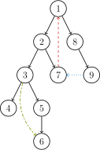

# 图论中的连通分量与相关算法（Tarjan 核心）
本文系统整理**强连通分量**、**双连通分量**（割点、桥、点/边双）的定义、Tarjan 算法实现及应用，补充关键细节与解释，突出核心考点。

## 一、强连通分量（SCC）
### 1. 核心定义（有向图专属）
- **强连通**：有向图中，任意两个顶点 $u, v$ 满足 $u$ 能到达 $v$ 且 $v$ 能到达 $u$
- **强连通分量（SCC）**：**极大**的强连通子图（无法再扩大的强连通子图）。
  - 关键性质：强连通分量彼此**不交**，是对图顶点的等价类划分。

### 2. DFS 树基础（有向图）
DFS 遍历有向图形成的树包含四类边（理解 Tarjan 关键）：
- **树边**：DFS 过程中访问未遍历节点形成的边（属于树结构）。
- **返祖边**/回边：非树边，从当前节点指向其 DFS 树中的祖先节点。
- **横叉边**：非树边，连接两个无祖先-后代关系的节点（跨子树/分支）。（搜索的时候遇到了一个已经访问过的结点，但是这个结点并不是当前结点的祖先）
- **前向边**：非树边，从当前节点指向其子树内的节点（未走树边直接到达）。

黑色-树边；红色-返祖边；蓝色-横叉边；绿色-前向边

### 3. Tarjan 算法求 SCC（核心）
视频讲解：[一条 DFS 就能找出所有强连通分量？Tarjan 算法秒懂！](https://www.bilibili.com/video/BV1s3BLByE6g/?spm_id_from=333.1387.favlist.content.click&vd_source=72190edb312d9a578f596ba937a9ebd2)
#### 核心思想
通过 DFS 维护**时间戳**和**栈**，标记每个节点能回溯到的最早祖先，从而划分强连通分量。

#### 维护变量
- `dfn[u]`：节点 $u$ 在 DFS 中首次被访问的时间戳（唯一）。
- `low[u]`：节点 $u$ 及其子树能到达的、**仍在栈中**的节点的最小 $dfn$ 值（核心）。
- 栈：存储当前 DFS 路径上未划分到 SCC 的节点。

#### 算法步骤
1. 访问节点 $u$，初始化 `dfn[u] = low[u] = ++ti`（$ti$ 为全局时间戳），将 $u$ 入栈并标记“在栈中”。
2. 遍历 $u$ 的所有出边 $u \to v$：
   - 若 $v$ 未被访问：递归访问 $v$，回溯后更新 `low[u] = min(low[u], low[v])`（子树能到的最早节点同步）。
   - 若 $v$ 已访问且**在栈中**：更新 `low[u] = min(low[u], dfn[v])`（利用返祖边/前向边缩小范围）。
   - 若 $v$ 已访问且**不在栈中**：为横叉边，无操作（$v$ 所属 SCC 已处理）。
3. 若 `dfn[u] == low[u]`（$u$ 是其所在 SCC 的根）：从栈中弹出节点直到 $u$，这些节点构成一个 SCC。

#### 代码实现
数组模拟栈
```cpp
#include <iostream>
#include <vector>
#include <stack>
using namespace std;

const int maxn = 10;
int ti = 0, top = 0, dcc = 0; // 时间戳、栈顶、连通分量编号
int dfn[maxn], low[maxn], sta[maxn], belong[maxn];
bool vis[maxn]; // 标记是否在栈中
vector<int> adj[maxn]; // 邻接表存储边
vector<int> vec[maxn]; // 存储每个SCC的节点

void tarjan(int u) {
    dfn[u] = low[u] = ++ti; // 初始化时间戳
    vis[sta[++top] = u] = true; // 节点入栈，标记在栈中
    // 遍历u的所有出边
    for (int v : adj[u]) {
        if (!dfn[v]) { // v未被访问
            tarjan(v);
            low[u] = min(low[u], low[v]); // 回溯更新low[u]
        } else if (vis[v]) { // v已访问且在栈中
            low[u] = min(low[u], dfn[v]); // 更新low[u]为更小的dfn[v]
        }
        // v已访问且不在栈中：无操作
    }
    // 找到SCC的根节点，弹出栈中节点
    if (dfn[u] == low[u]) {
        dcc++;
        int v = 0;
        while (v != u) {
            v = sta[top--];
            belong[v] = dcc;
            vis[v] = false; // 标记出栈
            vec[dcc].push_back(v);
        }
    }
}
//测试
int main() {
    // 构建邻接表
    adj[1].push_back(2);
    adj[2].push_back(3);
    adj[3].push_back(2);
    adj[3].push_back(4);
    adj[4].push_back(5);
    adj[5].push_back(4);
    
    // 执行Tarjan（从节点1开始遍历）
    tarjan(1);
    
    // 输出结果
    cout << "强连通分量数量：" << dcc << endl;
    for (int i = 1; i <= dcc; i++) {
        cout << "SCC " << i << "：";
        for (int x : vec[i]) cout << x << " ";
        cout << endl;
    }
    return 0;
}
```
用stack
```cpp
const int N = 10005;
vector<int> adj[N];
int dfn[N], low[N], timer;
stack<int> stk;
bool in_stk[N];
int scc_cnt, scc_id[N];

void tarjan(int u) {
    // 1. 初始化当前节点
    dfn[u] = low[u] = ++timer;
    stk.push(u);
    in_stk[u] = true;

    // 2. 遍历所有邻居
    for (int v : adj[u]) {
        if (!dfn[v]) {
            // 情况A: 树枝边（v 未访问）
            tarjan(v);
            // 回溯时，用子节点的 Low 更新自己
            low[u] = min(low[u], low[v]);
        } else if (in_stk[v]) {
            // 情况B: 返祖边（v 已在栈中）
            // 发现通往祖先的后门，用 DFN 更新
            low[u] = min(low[u], dfn[v]);
        }
    }

    // 3. 判定根节点并收网
    if (low[u] == dfn[u]) {
        scc_cnt++;
        int v;
        do {
            v = stk.top();
            stk.pop();
            in_stk[v] = false;
            scc_id[v] = scc_cnt;
        } while (u != v);
    }
}
```

#### 时间复杂度
$O(n + m)$（$n$ 为节点数，$m$ 为边数），每个节点和边仅遍历一次。

## 二、双连通分量（无向图）
无向图中无“方向”，DFS 树结构更简单：**无横叉边**（仅树边、返祖边），Tarjan 算法需处理“反向边”问题（避免重复遍历）。
视频讲解：[[算法]轻松掌握tarjan割点&桥算法](https://www.bilibili.com/video/BV1Q7411e7bM?spm_id_from=333.788.player.switch&vd_source=72190edb312d9a578f596ba937a9ebd2&p=2)
### 1. 核心预处理：处理无向边反向边
无向边存储为两条单向边（链式前向星），DFS 时需跳过“父边”（避免回头），两种方法：
- **方法1（简单图）**：DFS 传参数 `fa`（父节点），遍历边时跳过 $v = fa$。
- **方法2（通用）**：边编号从 2 开始，一对反向边的编号为 $i$ 和 $i \oplus 1$（如 2↔3、4↔5），DFS 时跳过反向边。

### 2. 割点（割顶）
#### 定义
去掉无向图中的某个节点（及关联边）后，图的连通分支数增加，则该节点为**割点**。

#### Tarjan 求割点规则
1. **根节点**：若 DFS 树的根节点有 ≥2 棵子树，则根是割点（去掉根后子树互不连通）。
2. **非根节点**：对节点 $u$ 的子节点 $v$，若 `low[v] ≥ dfn[u]`（$v$ 无法通过子树回到 $u$ 的祖先），则 $u$ 是割点（去掉 $u$ 后 $v$ 子树与原图分离）。

#### 代码实现
```cpp
const int maxn = 1e5 + 5;
int t, cut[maxn]; // cut[u]标记u是否为割点
int dfn[maxn], low[maxn];
stack<int> s;

void tarjan(int u, int rt) {
    low[u] = dfn[u] = ++t;
    s.push(u);
    int child = 0; // 根节点的子树数
    for (int i = head[u]; i; i = a[i].next) {
        int v = a[i].to;
        if (!dfn[v]) {
            tarjan(v, rt);
            low[u] = min(low[u], low[v]);
            // 非根节点：判断是否满足割点条件
            if (u != rt && low[v] >= dfn[u]) cut[u] = 1;
            // 根节点：统计子树数
            else if (u == rt) child++;
        } else {
            low[u] = min(low[u], dfn[v]);
        }
    }
    // 根节点：子树数>1则为割点
    if (u == rt && child > 1) cut[u] = 1;
}
```
```cpp
void tarjan(int u,int rt){
    low[u]=dfn[u]=++t;
    //vis[u]=1;s.push(u);
    int child=0;
    for(int i=head[u];i;i=a[i].next){
        int v=a[i].to;
        if(!dfn[v]){
            tarjan(v,rt);
            low[u]=min(low[u],low[v]);
            if(u!=rt&&low[v]>=dfn[u])cut[u]=1;
            else if(u==rt)
                child++;
        }
        else low[u]=min(low[u],dfn[v]);
    }
    if(u==rt&&child>1)cut[u]=1;
}
```
### 3. 桥（割边）
#### 定义
去掉无向图中的某条边后，图的连通分支数增加，则该边为**桥**（割边）。

#### Tarjan 求桥规则
与割点类似，核心区别：对节点 $u$ 的子节点 $v$，若 `low[v] > dfn[u]`（$v$ 无法通过子树回到 $u$ 或其祖先），则边 $u \to v$ 是桥。
- 注意：有重边时，需排除反向边但保留重边（重边存在时，该边不可能是桥）。

### 4. 边双连通分量（E-DCC）
#### 定义
- **边双连通**：无向图中两个节点 $u, v$ 之间，去掉任意一条边后仍连通（存在两条边不相交的路径）。
- **边双连通分量**：极大的边双连通子图（内部无割边）。
- 关键性质：边双连通分量是**等价类划分**（一个节点仅属于一个边双），割边是分量的边界（割边不属于任何边双）。

#### 求法
- **方法1**：复用 Tarjan 框架（排除反向边），与 SCC 求法类似，栈中弹出节点的条件为 `dfn[u] == low[u]`。
- **方法2**：先求所有割边，再对原图 DFS/BFS，遇到割边则停止，遍历到的节点构成一个边双。

### 5. 点双连通分量（V-DCC）
#### 定义
- **点双连通**：无向图中两个节点 $u, v$ 之间，去掉任意一个非 $u,v$ 的节点后仍连通（存在两条点不相交的路径）。
- **点双连通分量**：极大的点双连通子图（内部无割点）。
- 关键性质：点双连通分量**不是等价类划分**（一个割点可能属于多个点双），割点是分量的边界（割点包含在所属点双中）。

#### 求法
与割点求解同步：当发现 `low[v] >= dfn[u]` 时，从栈中弹出节点直到 $v$（$u$ 不弹出），这些节点 + $u$ 构成一个点双。

#### 代码实现（核心片段）
```cpp
const int maxn = 1e5 + 5;
int ti, top, cnt;
int dfn[maxn], low[maxn], sta[maxn], belong[maxn];
vector<int> dcc[maxn]; // 存储每个点双的节点

inline void tarjan(int u) {
    low[u] = dfn[u] = ++ti;
    sta[++top] = u;
    for (int i = head[u], v; i; i = e[i].next) {
        v = e[i].to;
        if (dfn[v]) {
            low[u] = min(low[u], dfn[v]);
        } else {
            tarjan(v);
            low[u] = min(low[u], low[v]);
            // 找到点双的边界
            if (low[v] == dfn[u]) {
                cnt++;
                int k = 0;
                while (k != v) {
                    k = sta[top--];
                    belong[k] = cnt;
                    dcc[cnt].push_back(k);
                }
                dcc[cnt].push_back(u); // u加入点双（不弹出栈）
            }
        }
    }
}
```

## 三、核心应用：缩点
### 1. 缩点思想
将每个**强连通分量/双连通分量**缩为一个新节点，原图转化为：
- 强连通分量缩点后 → **有向无环图（DAG）**；
- 双连通分量缩点后 → 以割点/桥为连接的简化图。

### 2. 缩点后操作
缩点后的 DAG 可进行**拓扑排序**，结合动态规划解决最大路径、计数等问题（如“受欢迎的牛”问题）。

## 四、补充算法
### 1. 拓扑排序（DAG 专属）
#### 定义
对 DAG 的顶点排序，使得对任意边 $(u, v)$，$u$ 在排序中出现在 $v$ 之前。

#### 代码实现（拓扑排序模板）
```cpp
const int maxn = 1e5 + 5;
int deg[maxn]; // 入度
int q[maxn]; // 队列

inline void topo() {
    int l = 1, r = 0;
    // 初始入度为0的节点入队
    for (int i = 1; i <= n; ++i) if (!deg[i]) q[++r] = i;
    while (l <= r) {
        int u = q[l++];
        for (int i = head[u], v; i; i = e[i].next) {
            v = e[i].to;
            if (--deg[v] == 0) q[++r] = v; // 入度为0则入队
        }
    }
}
```

### 2. ST 表（RMQ 问题）
用于解决**静态区间最值查询（RMQ）**，预处理 $O(n\log n)$，查询 $O(1)$。

#### 代码实现
```cpp
const int maxn = 1e5 + 5;
int lg[maxn], t[maxn][20]; // lg[]预处理log2值，t[i][j]表示[i, i+2^j-1]的最大值

// 预处理ST表
inline void init(int n) {
    // 预处理lg数组
    lg[1] = 0;
    for (int i = 2; i <= n; ++i) lg[i] = lg[i >> 1] + 1;
    // 构建ST表
    for (int j = 1; j <= lg[n]; ++j) {
        for (int i = 1; i + (1 << j) - 1 <= n; ++i) {
            t[i][j] = max(t[i][j-1], t[i + (1 << (j-1))][j-1]);
        }
    }
}

// 查询[l, r]的最大值
inline int query(int l, int r) {
    int p = lg[r - l + 1];
    return max(t[l][p], t[r - (1 << p) + 1][p]);
}
```

## 五、拓展与经典例题
### 1. 拓展：2-SAT 问题
结合**扩展域并查集** + Tarjan 强连通分量（缩点）解决，核心是将逻辑命题转化为有向图，通过 SCC 判断可行性。

### 2. 经典例题
| 题目编号 | 题目名称 | 核心考点 |
|----------|----------|----------|
| P3388    | 【模板】割点（割顶） | 割点的 Tarjan 实现 |
| P2341    | 受欢迎的牛 G | 强连通分量缩点 + 拓扑排序 |
| P1726    | 上白泽慧音 | 强连通分量 + 缩点 + DP |
| P2661    | 信息传递 | 强连通分量（找最小环） |
| P3225    | 矿场搭建 | 点双连通分量 + 组合数学 |
| P3387    | 【模板】缩点 | 强连通分量缩点 + 拓扑DP |
| P3865    | 【模板】ST 表 & RMQ 问题 | ST 表预处理与查询 |
| P1038    | 神经网络 | 拓扑排序 + 动态规划 |

## 六、核心总结
1. Tarjan 算法是连通分量问题的核心，核心是维护 `dfn` 和 `low`，利用栈划分分量；
2. 有向图关注强连通分量，无向图关注双连通分量（割点、桥、点/边双）；
3. 缩点是连通分量的核心应用，可将复杂图转化为 DAG 简化问题；
4. 无向图需注意反向边处理，有向图需区分横叉边/返祖边的影响。